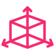
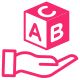
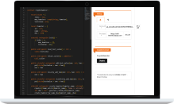

<section id="header" class="section section--hero">

::: content section-content

# Welcome Developer, Node Operator and Miner
This page helps you to get started with æternity.
:::

<a href="#getting_started" class="button button--large section-button">Get started</a>

</section>
<section id="why" class="section section--normal">

::: content section-content

## Why æternity
If you are already familiar with basic blockchain principles and smart contracts, start with learning
about æternity’s unique features. The æternity protocol ships with a rich set of features
and functionality out of the box.

A full specification and documentation of the protocol can be found on GitHub
:::

<a href="https://github.com/aeternity" class="button button--normal">View at GitHub</a>

</section>
<section id="technical_advantages" class="section section--fancy">

::: content section-content

## Technical advantages compared to major platforms</h2>

:::

<AdvantagesOrbits />

Reference implementation written in Erlang by industry experts, the language that powers 90% of today’s world wide web. <a href="http://erlang.com">Learn more</a>

</section>
<section id="protocol" class="section section--normal">
    

        <h2>The æternity protocol is</h2>
    

    

        

            <label for="Universal"></label>
            <label for="Secure"></label>
            <label for="Scalable"></label>
            <label for="Efficient-low-to-no-fees"></label>
            <label for="Interoperable-Oracles"></label>
            <label for="Open-Source"></label>
            <label for="Decentralized"></label>
            <label for="Public-and-Private"></label>
            <label for="User-Friendly"></label>
            <label for="Governance"></label>
            <label for="Development-Sustainability"></label>
        

        

            <input type="radio" name="protocol-menu" id="Universal" checked>
            

                <label for="Universal">Universal</label>
                

                    
                    <h3>Universal</h3>
                    

                        The æternity protocol can do everything that you expect from a Smart Contract
                        Blockchain platform like Ethereum or others. It can be used to power <b>Games, Payments,
                        Identity, Decentralized Finance, Registries, Token-Economy, Logistics and more.</b> Some of
                        the things are not yet invented that will be built with æternity. <strong>The future
                        is yours.</strong>
                    

                

            

            <input type="radio" name="protocol-menu" id="Secure">
            

                <label for="Secure">Secure</label>
                

                    
                    <h3>Secure</h3>
                    

                        &AElig;eternity is built with security in mind. The reference implementation is written in
                        Erlang, following all standards of high-quality software engineering. Recurring security
                        audits and intensive property based testing are part of the daily work of the protocol
                        developers. In its security aspects on blockchain, the æternity protocol gets shipped
                        with a type safe virtual machine called FATE (Fast Aeternity Transaction Engine) which was
                        engineered to boost efficiency (gas consumption) and security (type safe). Together with
                        Sophia, a functional smart contract language that supports formal verification, the æternity
                        protocol provides an unique take on blockchain and smart contract security. A highly paid
                        bug bounty program is available for security researchers.
                    

                

            

            <input type="radio" name="protocol-menu" id="Scalable">
            

                <label for="Scalable">Scalable</label>
                

                    
                    <h3>Scalable</h3>
                    

                        In order to scale to billions of users and transactions the æternity protocol provides
                        trustless scaling through off-chain state channels. Without compromising on security state
                        channels allow peer to peer transaction between users and the execution of smart contracts
                        off-chain. This way æternity has no limits in scaling. The network consensus of the
                        protocol is fast. In average up to 15 times faster with a higher transaction throughput then
                        comparable protocols. The confirmation time is as less as three seconds, which especially
                        comes into account when looking at user experience.
                    

                

            

            <input type="radio" name="protocol-menu" id="Efficient-low-to-no-fees">
            

                <label for="Efficient-low-to-no-fees">Efficient low-to-no fees</label>
                

                    
                    <h3>Efficient low-to-no fees</h3>
                    

                        æternity is equipped with dozens of unique native transactions types for State
                        Channels, Oracles, Names among others. All functionality is optimized to work with minimal
                        gas cost. Additionally, once established, within off-chain State Channels, there are no fees
                        for transactions or smart contract executions. On-chain, with Bitcoin-NG, the consensus
                        mechanism of the protocol allows for more transactions and gas (smart contract executions)
                        per block. This relaxes the fee and gas market and leads to lower cost. Combined with the
                        execution of smart contracts through the highly efficient FATE VM, less overall Gas is
                        needed. Additionally with off-chain State Channels, the æternity protocol reduces the
                        on-chain transaction and smart contract execution volumes massively, which lowers the fees.
                    

                

            

            <input type="radio" name="protocol-menu" id="Interoperable-Oracles">
            

                <label for="Interoperable-Oracles">Interoperable Oracles</label>
                

                    
                    <h3>Interoperable Oracles</h3>
                    

                        Oracles are a special type of transactions on æternity to request and provide data
                        from data providers and APIs. If a smart contract for example is in need of today's weather
                        data, a oracle request transaction including a data schema can be broadcasted on chain. Data
                        providers can respond to data and charge a fee for providing the response. The other way
                        around oracle provides can register on-chain and provide all types of data for free or by
                        charging a fee. This allows smart contract developers to interact and build upon all sorts
                        of APIs and create applications which are dependent on outside data (for example the current
                        price of Bitcoin at a certain time).
                    

                

            

            <input type="radio" name="protocol-menu" id="Open-Source">
            

                <label for="Open-Source">Open Source</label>
                

                    
                    <h3>Open Source</h3>
                    

                        The protocol and all essential developer resources are fully open source. There is no
                        proprietary license whatsoever. The development is transparent and everyone can start
                        contributing via GitHub, the Forum or physical Meetups.
                    

                

            

            <input type="radio" name="protocol-menu" id="Decentralized">
            

                <label for="Decentralized">Decentralized</label>
                

                    
                    <h3>Decentralized</h3>
                    

                        With Satoshi’s heritage in its core (Nakamoto Consensus) the protocol is build to be
                        decentralized. Everyone can host a node and start mining, connect to the network and help to
                        secure the chain or verify transaction. The network is operated by an community of thousands
                        of nodes. It is fully trustless, there is no central authority, no master nodes or
                        kill-switches. With Cuckoo Circle, æternity has chosen a highly efficient
                        proof-of-work algorithm which is the first graph-theoretic proof-of-work, and the most
                        memory bound, yet with instant verification.
                    

                

            

            <input type="radio" name="protocol-menu" id="Public-and-Private">
            

                <label for="Public-and-Private">Public and Private</label>
                

                    
                    <h3>Public and Private</h3>
                    

                        The æternity protocol is using the accounts model. All transactions are public by
                        default. Aeternity allows a very flexible and open design of accounts, which is called
                        Generalized Accounts that enable signing transactions with a high flexibility.
                        Cryptographically the protocol uses Blake2b (256 bits digest) and ed25519. It supports
                        Schnorr Signatures. The communication between nodes is encrypted with the noise protocol.
                        Off-chain State Channel transactions and smart contract executions are fully private unless
                        published on-chain for dispute resolution. It is easy to setup a private blockchain network
                        (example for Enterprise or Public Institutions).
                    

                

            

            <input type="radio" name="protocol-menu" id="User-Friendly">
            

                <label for="User-Friendly">User Friendly</label>
                

                    
                    <h3>User Friendly</h3>
                    

                        A built-in Naming System for human readable names allows you to point names to accounts and
                        contracts (Example: ak_XbqHD3RYPb3w3eVopLyc... becomes yourname.chain). This makes
                        transacting tokens between peers easiest and can help to make smart contract code more
                        readable and upgradable.
                    

                

            

            <input type="radio" name="protocol-menu" id="Governance">
            

                <label for="Governance">Governance</label>
                

                    
                    <h3>Governance</h3>
                    

                        The æternity community is governed by miners, users and developers. Through hard-fork
                        signaling node operators can show their support for hard upgrades. All token holders can
                        join a weighted delegated polling mechanism through an mobile and user friendly app with
                        verifiable results on the æternity blockchain. Discussions are taking place in chat
                        rooms, online forums, public events and in the aexpansions repository on GitHub.
                    

                

            

            <input type="radio" name="protocol-menu" id="Development-Sustainability">
            

                <label for="Development-Sustainability">Development Sustainability</label>
                

                    
                    <h3>Development Sustainability</h3>
                    

                        The protocol is robust and reliable and build to last for æternity even without
                        maintenance or the development of new features. Nevertheless, the æternity crypto
                        foundation currently receive around 10.8% of the mining reward to support the long-term
                        development and maintenance of the core protocol and essential resources. There is an open
                        R&D Grant program available at <a href="https://www.aeternity-foundation.org">www.aeternity-foundation.org</a>as
                        well as a Development Bounty program for contributors. To enable entrepreneurs and business
                        to launch their own startup, there are programs for entrepreneurs <a
                            href="https://www.aeternitystarfleet.com">www.aeternityStarfleet.com</a> and a venture
                        fund <a href="https://www.aeternity-ventures.com">www.aeternity-ventures.com</a> to
                        kick-start even more.
                    

                

            

        

    

    <a href="#getting_started" class="button button--normal">Get started</a>
</section>
<section id="sophia" class="section section--alt">
    

        <h2>Safe smart contract development with Sophia</h2>
        

            An æternity blockchain language The Sophia is a language in the ML family. It is a strongly typed
            and has a restricted mutable state.
        

    

    

        

            
        

        

            <h3>What is Sophia?</h3>
            

                Sophia is customized for smart contracts, which can be published to a blockchain (the æternity
                BlockChain). Thus some features of conventional languages, such as floating point arithmetics, are
                not present in Sophia, and some blockchain specific primitives, constructions and types have been
                added.
            

            <h3>Links</h3>
            <ul class="sophia-links">
                <li>
                    <a href="https://github.com/aeternity/protocol/blob/master/contracts/sophia.md">Documentation</a>
                </li>
                <li>
                    <a href="https://github.com/aeternity/aepp-sophia-examples">Examples on GitHub</a>
                </li>
                <li>
                    <a href="https://marketplace.visualstudio.com/items?itemName=MilenRadkov.sophia">Code
                        Highlighting</a> for VSCode and other IDE’s
                </li>
            </ul>
            <h3>Educational material</h3>
            

                
                <small>
                    <a href="https://dacade.org/ae-dev-101/introduction">Online Course from Dacade.org</a> 
                    Check out the highly recommended æternity 101 course on Dacade, a peer learning platform.
                    Courses are free, a certificate will be given and you earn 100 AE token on completion.
                </small>
            

            

                
                <small>
                    <a>Tutorials about Sophia</a> 
                    Available on GitHub but might be outdated.
                </small>
            

        

    

    

        

            <a href="https://forum.aeternity.com/c/development/sophia-smart-contracts" class="button button--small">Get
                help</a>
            
in The Forum

        

        

            <a href="https://devchat.aeternity.com" class="button button--small">Chat</a>
            
in DevChat

        

        

            <a href="https://github.com/aeternity/aesophia" class="button button--small">Contribute</a>
            
via GitHub

        

    

</section>
<section id="getting_started" class="section section--fancy">
    

        <h2>Getting started</h2>
        

            If you are new to æternity and want to try out the Sophia Smart Contract Language, is is suggested
            to use one of the community developed online IDE’s. They allow you to write contracts, compile them,
            post them to the chain on testnet and call its functions.
        

        

            

                <h3>Try it in the browser</h3>
                <h4>Try it in the browser with one of the IDE’s</h4>
                <ul class="try-browser-options">
                    <li>
                        
                        <a href="https://testnet.contracts.aepps.com">Contracts</a>
                    </li>
                    <li>
                        
                        <a href="https://testing.playground.aepps.com/editor">Playground</a>
                    </li>
                    <li>
                        
                        <a href="http://fireeditor.nikitafuchs.de">FireEditor</a>
                    </li>
                </ul>
                

                    &AElig;project is an æternity framework which helps with setting up a project. The
                    framework makes the development of smart contracts in the æternity network pretty easy. It
                    provides commands for compilation, deployment of smart contracts, running a local node, local
                    compiler and unit testing the contracts.
                

            

            

                <h3>Try it locally</h3>
                <h4>Try it locally and setup your development environment in no-time.</h4>
                

                    
                    

                        
                        <a href="https://github.com/aeternity/aepp-aeproject-js">&AElig;Project</a>
                    

                

            

        

        

            

                <a href="https://forum.aeternity.com/c/development/sophia-smart-contracts"
                   class="button button--small">Get help</a>
                
in The Forum

            

            

                <a href="https://devchat.aeternity.com" class="button button--small">Chat</a>
                
in DevChat

            

            

                <a href="https://github.com/aeternity/aesophia" class="button button--small">Contribute</a>
                
via GitHub

            

        

    

</section>
<section id="developer_tools" class="section section--normal">
    

        <h2>Developer tools</h2>
        

            Programming libraries are available. Any Javascript developer can build a simple æternity app in
            one day. For a quick start and reference SDK it is recommended to use the JavaScript one.
        

    

    

        

            

                
                <h3>Node HTTP API</h3>
                

                    æternity <a href="https://api-docs.aeternity.io">Node API</a>
                

            

        

        

            

                
                <h3>SDK Frontend APIs</h3>
                <ul class="unstyled">
                    <li>
                        <a href="https://github.com/aeternity/aepp-sdk-js">JavaScript</a> (recommended) 
                    </li>
                    <li>
                        <a href="https://github.com/aeternity/aepp-sdk-python">Python</a> 
                    </li>
                    <li>
                        <a href="https://github.com/aeternity/aepp-sdk-go">Go</a> 
                    </li>
                    <li>
                        <a href="https://github.com/kryptokrauts/aepp-sdk-java">Java</a> (Community Maintained) 
                    </li>
                </ul>
            

        

        

            

                
                <h3>Middleware Backend API</h3>
                

                    The <a href="https://github.com/aeternity/aeternal">Middleware</a> is a caching and reporting
                    layer which sits in front of the nodes of the æternity blockchain. Its purpose is to
                    respond to queries faster than the node can do, and to support queries that for reasons of
                    efficiency the node cannot or will not support itself.
                

            

        

        

            

                
                <h3>CLI - Command Line Client</h3>
                

                    Quickly test all of Aeternity’s blockchain features from your Terminal, you can Install and use
                    our
                    <a href="https://github.com/aeternity/aepp-cli-js">NodeJS CLI</a>!
                

            

        

    

    

        

            <a href="https://forum.aeternity.com/c/aepplications" class="button button--small">Get help</a>
            
in The Forum

        

        

            <a href="https://devchat.aeternity.com" class="button button--small">Chat</a>
            
in DevChat

        

        

            <a href="https://github.com/aeternity" class="button button--small">Contribute</a>
            
via GitHub

        

    

</section>
<section id="useful" class="section section--alt">
    

        <h2>Useful resources</h2>
    

    

        

            

                <h3>Hosted API Server, Public Nodes and Services</h3>
                

                    For convenience reasons, there are hosted services available to quick start the development of
                    æternity blockchain applications on testnet. Even though all services are available for
                    mainnet too, it is not advised to use these services in production. Therefore self-hosting
                    critical infrastructure is recommended.
                

                <ul>
                    <li>
                        Testnet API Gateway Nodes hosted on <a href="https://testnet.aeternity.io/api">https://testnet.aeternity.io</a>
                    </li>
                    <li>
                        Testnet Middleware API Server <a href="https://testnet.mdw.aepps.com/api">https://testnet.mdw.aepps.com</a>
                    </li>
                    <li>
                        Sophia Smart Contract Compiler <a href="https://compiler.aepps.com">https://compiler.aepps.com</a>
                    </li>
                </ul>
                

                    To get some free AE tokens, use the testnet Token Faucet
                    <a href="https://testnet.faucet.aepps.com">https://testnet.faucet.aepps.com</a>
                

            

        

        

            

                <h3>Resources</h3>
                <ul>
                    <li>
                        <h4>Middleware Explorer (Testnet/Mainnet)</h4>
                        <ul>
                            <li>
                                Mainnet <a href="https://mainnet.aeternal.io">https://mainnet.aeternal.io</a>
                            </li>
                            <li>
                                Testnet <a href="https://testnet.aeternal.io">https://testnet.aeternal.io</a>
                            </li>
                        </ul>
                    </li>
                    <li>
                        <h4>Blockchain Explorer (Testnet/Mainnet)</h4>
                        <ul>
                            <li>
                                <b>Aeternity Explorer</b>
                                <ul>
                                    <li>
                                        Mainnet <a href="https://explorer.aepps.com">https://explorer.aepps.com</a>
                                    </li>
                                    <li>
                                        Testnet <a href="https://testnet.explorer.aepps.com">https://testnet.explorer.aepps.com</a>
                                    </li>
                                </ul>
                            </li>
                            <li>
                                <b>AEknow</b>
                                <ul>
                                    <li><a href="https://aeknow.org">https://aeknow.org</a></li>
                                </ul>
                            </li>
                        </ul>
                    </li>
                    <li>
                        <h4>Goggles Transaction Inspector</h4>
                        <ul>
                            <li>
                                Mainnet <a href="https://goggles.aepps.com">https://goggles.aepps.com</a>
                            </li>
                            <li>
                                Testnet <a href="https://testnet.goggles.aepps.com">https://testnet.goggles.aepps.com</a>
                            </li>
                        </ul>
                    </li>
                </ul>
            

        

    

</section>
<section id="interfaces" class="section section--normal">
    

        <h2>Interfaces and clients</h2>
        

            Three major clients to interact with æternity blockchain applications, sign contract calls and do
            transactions.
        

    

    

        

            

                <h3>Base iOS/Android/Web Wallet and Browser</h3>
                <a href="https://github.com/aeternity/aepp-base" class="button button--small">View on GitHub</a>
            

        

        

            

                <h3>Wællet Browser Extension</h3>
                <a href="https://github.com/aeternity/aepp-waellet" class="button button--small">View on GitHub</a>
            

        

        

            

                <h3>Blockchain Explorers</h3>
                <ul>
                    <li><a href="https://explorer.aepps.com">explorer.aepps.com</a></li>
                    <li><a href="https://mainnet.aeternal.io">mainnet.aeternal.io</a></li>
                    <li><a href="https://aeknow.org">aeknow.org</a></li>
                </ul>
            

        

    

    

        

            A variety of community build wallets are available, such as:
        

        <ul>
            <li><a href="https://airgap.it">Airgap Vault and Wallet</a></li>
            <li><a href="https://trustwallet.com">Trust Wallet</a></li>
        </ul>
    

    

        

            It is possible to buy æternity tokens on exchanges like Binance, OKex, Huobi, gate.io and many
            others. A full list of markets can be found via: <a href="https://coinmarketcap.com">coinmarketcap</a>
        

        <ul>
            <li><a href="https://www.binance.com/">binance</a></li>
            <li><a href="https://www.okex.com">okex</a></li>
            <li><a href="https://www.huobi.com">huobi</a></li>
            <li><a href="https://www.gate.io">gate.io</a></li>
        </ul>
    

</section>
<section id="run_node" class="section section--alt">
    

        <h2>Run your own node and services</h2>
    

    

        

            

                
                <h3>How to host a Node</h3>
                <a href="https://docs.aeternity.io/" class="button button--small">View docs</a>
            

        

        

            

                
                <h3>How to host the Sophia Smart Contract Compiler</h3>
                <a href="https://github.com/aeternity/aesophia_http" class="button button--small">View on GitHub</a>
            

        

        

            

                
                <h3>How to host a Middleware API Server</h3>
                <a href="https://github.com/aeternity/aeternal" class="button button--small">View on GitHub</a>
            

        

    

</section>
<section id="miners" class="section section--normal">
    

        <h2>For miners, pools and node operators</h2>
        

            To get the latest version of æternity node, please check out the <a
                href="https://github.com/aeternity/aeternity/releases">latest published packages</a> and the <a
                href="https://github.com/aeternity/aeternity/tree/master/docs/release-notes">release notes</a>
        

    

    

        

            

                <h3>Run a node</h3>
                <a href="https://docs.aeternity.io/en/stable/installation/" class="button button--small">View on
                    GitHub</a>
            

        

        

            

                <h3>Run a mining pool</h3>
                <a href="https://docs.aeternity.io/en/stable/stratum/" class="button button--small">View on
                    GitHub</a>
            

        

        

            

                <h3>Choose a mining client</h3>
                <a class="button button--small">Choose</a>
            

        

        

            

                <h3>Join an existing mining pool</h3>
                <a class="button button--small">Join</a>
            

        

    

</section>
<section id="community" class="section section--alt">
    

        <h2>Join the community</h2>
    

    <ul class="icons communities">
        <li class="icon community">
            <a href="https://forum.aeternity.com/search?q=developers%20update%20call%20order%3Alatest">
                
                Public developers update call
            </a>
        </li>
        <li class="icon community">
            <a href="https://forum.aeternity.com">
                
                Forum
            </a>
        </li>
        <li class="icon community">
            <a href="https://devchat.aeternity.com">
                
                Devchat
            </a>
        </li>
        <li class="icon community">
            <a href="https://www.aeternity-foundation.org">
                
                Development bounties
            </a>
        </li>
        <li class="icon community">
            <a href="https://www.aeternity-foundation.org">
                
                Development grants
            </a>
        </li>
    </ul>
</section>
