<Section id="header" type="hero">

<video autoplay loop muted playsinline onload="this.play()" preload="metadata">
  <source src="./img/background.mp4" type="video/mp4">
</video>

# A Blockchain for scalable,<br> secure, and decentralized æpps

::: slot buttons

- [Get started](#getting_started)
- [Get involved](#community)

:::

::: slot bottom
<Metrics/>
:::

</Section>

<Section id="innovative">

## Why is æternity so innovative?
æternity blockchain is an Erlang-based scalable smart contract platform engineered by programming pioneers to address some of the most fundamental challenges native to earlier blockchains. 
By redesigning blockchain technology at the protocol level, the æternity developer community has enabled the core protocol to understand and integrate a rich set of functionalities out of the box.

::: slot ribbon

-  Sophia smart contracts
  - ### Smart contracts: Sophia
    æternity smart contract programming is unique: Sophia is a typed functional programming language in the ML family that makes it easier to write correct programs.

    [Read more](https://aeternity.com/documentation-hub/protocol/contracts/sophia/)
-  FATE VM
  - ### FATE Virtual Machine: faster, simpler, safer code
    The Fast æternity Transaction Engine, or FATE VM, uses a higher level of abstraction and automatically minimizes error with type checking, delivering a simpler, easier, safer programming environment.

    [Read more](https://github.com/aeternity/protocol/blob/e2940192379916fb21a053b3ab09d1dff2ac76ef/contracts/fate.md)
-  Advanced state channels
  - ### Advanced State Channels Technology
    Unlike most blockchains, æternity’s core protocol was re-engineered specifically so it can accommodate state channels on a protocol level, making it easier to build applications for global-scale enterprise use cases. 

    [Read more](https://aeternity.com/documentation-hub/protocol/channels/)
-  Oracles
  - ### Oracles
    æternity Oracles enable the integration of real-world data into the blockchain—a feature that has an endless range of potential use cases for business, science, and all other industries across the globe.

    [Read more](https://aeternity.com/documentation-hub/protocol/oracles/oracles/)
-  Unique governance
  - ### Unique governance
    Miners are not the only ones who get a vote on decisions—æternity token holders can use their AE tokens to signify their vote through the Governance Aepp.

    [Read more](https://github.com/aeternity/aepp-governance)
-  Naming system
  - ### Naming system
    The æternity Naming System (AENS) employs safe, human-readable names in place of the current system of long hashes used in blockchain transactions, reducing room for error for users.

    [Read more](https://aeternity.com/documentation-hub/protocol/AENS/)

:::

::: slot buttons

- [Read the Whitepaper](https://raw.githubusercontent.com/keypair/white-paper/master/aeternity-whitepaper.pdf)

:::

</Section>

<Section id="assets">

## Use cases

Having corrected the fundamental scalability flaws in earlier blockchains, the æternity protocol is engineered to accommodate large-scale enterprise use cases. æternity boasts of advanced features that connect real-world data from the Internet with the blockchain-at soft real-time.

Below are a few use cases that would be highly beneficial for most organizations:

* Documents, contracts, invoices, receipts
* Decentralized Finance (DeFi) 
* Payments, loans, shares
* Decentralized Autonomous Organization (DAO)
* Voting and governance
* Identity
* IoT blockchain identities and hardware
* Games

::: slot buttons

- [Edit this site](https://github.com/aeternity/web-dev/edit/master/index.md)

   Create a PR

:::

::: slot bottom

æternity delivers the power to tokenize both virtual and real-world assets
including, but not limited to:

:::

::: slot cards

- ### FUNGIBLE TOKENS
  * In Game Points
  * Stable Coins
  * Loyalty Points
  * System Credits
  * Cryptocurrencies
- ### NON-FUNGIBLE TOKENS
  * In Game Items
  * Supply Chain
  * Real Estate
  * Identity
  * Certifications
  * Collectables
- ### RESTRICTED FUNGIBLE TOKENS
  * Securities
  * Government Issued Fiat
  * Certifications
- ### RESTRICTED NON-FUNGIBLE TOKENS
  * Real Estate
  * Ownership Registries
  * Regulatory Certifications

:::

</Section>

<Section id="brief_history">

## History

- **2020+** forecast of a million æpp transactions by legal blockchain entities
- **2019** æternity universe ecosystem and first tokens on æ
- **2018** æternity Mainnet blockchain launch
- **2017** crowdfunding over BTC and ETH
- **2016** initial company forms in Liechtenstein

</Section>

<Section id="technical_advantages" type="fancy">

<video autoplay loop muted playsinline onload="this.play()" preload="metadata">
  <source src="./img/background.mp4#t=29" type="video/mp4">
</video>

## Technical advantages

- 
  No scaling limits with built-in trustless, off-chain State Channels
- 
  Highest security standards with a type-safe VM and functional Smart Contract language
- 
  ~3 second block confirmation times
- 
  Low on-chain fees due to highly optimized consensus, VM, and native transaction types
- 
  No off-chain fees for transactions and Smart Contract execution in State Channels
- 
  Built-in Naming System for human-readable names
- 
  Private transactions and smart contracts in state channels
- 
  Built-in Oracles for accessing external API’s and real world data
- 
  Highly flexible generalized account model supporting all types of signing options

>  
> 
> Reference implementation written in Erlang by industry experts, the language that powers 90% of today’s world wide web. [Learn more](https://en.wikipedia.org/wiki/Erlang_(programming_language))

</Section>

<Include path="sections/protocol" />

<Section id="state_channels">

## State Channels

State channels make it possible to execute smart contracts off-chain. The blockchain enforces the 
smart contract code only in the case of a disagreement between the contracting parties. 

::: slot bottom


> ### State Channels
> 
> æternity can scale to billions
> of transactions with off-chain
> State Channels. [Read more](https://aeternity.com/documentation-hub/protocol/channels/)

:::

</Section>

<Section id="inner_workings" type="fancy">

## Less noise. More work.

Featured in Electric Capital’s Report for being among the projects with the most committed developers per month — over 50. It is also noted that æternity has an impressive amount of dev activity ranking top 5 according to Santiment.


> 1/31/2018 - 1/31/2019 -- Electric Capital Internal Data.
> Excluding private repositories.

## The structure of æternity


</Section>

<Section id="sophia" type="alt">

## Safe Smart Contracts with Sophia
Sophia is a functional Smart Contract language in the ML family. It is strongly-typed and has a restricted mutable state. Sophia is a Ocaml-like language with syntax mostly resembling that of Reason.

::: slot body

<div class="sophia-content">
    <div class="sophia-graphic">
        
    </div>
<div class="sophia-text">

### What is Sophia?
 The Sophia language was created to easily utilize the potentials of the æternity protocol. Some features of conventional languages, such as floating point arithmetics for example, are not present, while some blockchain-specific primitives, constructions, and types have been added.

### Links
- [Documentation](https://github.com/aeternity/aesophia/blob/lima/README.md)
- [Examples on GitHub](https://github.com/aeternity/aepp-sophia-examples)
- [Code Highlighting](https://marketplace.visualstudio.com/items?itemName=MilenRadkov.sophia) for VSCode and other IDE’s

### Educational material
 [Online Course from Dacade.org](https://dacade.org/ae-dev-101/introduction)<br>
Check out the highly recommended æternity 101 course on Dacade, a peer-to-peer learning platform.
Courses are free and you will be given a certificate upon completion.

### Community materials
  - [Sophia course (Basic)](https://drive.google.com/file/d/1NIhiVcByLmg9VcTcHqxcVo7oT112Bz2O/view?usp=sharing) (.pdf) - ORT university in Montevideo, Uruguay
  - [Sophia course (Intermediate)](https://drive.google.com/file/d/1k6vAWLLDePMaOX5-hD69JIKpDWqTuXf3/view?usp=sharing) (.pdf) - ORT university in Montevideo, Uruguay

</div>
</div>

:::    

::: slot buttons

- [Get help](https://forum.aeternity.com)

   in the Forum

:::

</Section>

<Section id="getting_started" type="fancy">

## Getting started

In order to get started, try out the community developed online IDE or set up your own development environment with the local development framework AEproject.

- ###  Try it in the browser
  Start writing and testing Sophia Smart Contracts instantly. Click on the link below to launch the Contract compiler.
  - 

    [Contract compiler](https://contracts.aepps.com)

- ###  Try it locally
  Use AEproject to set up your local development environment in minutes.
  ```
  npm i -g aeproject
  ```
  - 

    [AEproject](https://github.com/aeternity/aepp-aeproject-js)

::: slot buttons

- [Get help](https://forum.aeternity.com)

   in the Forum

:::

</Section>

<Section id="developer_tools">

## Developer tools
Programming libraries are available. Any Javascript developer can build a simple æternity app in one day. For a quick start and reference, it is recommended to use the JavaScript SDK.

::: slot cards

- 
  ### Node HTTP API

  Hosted and auto-generated [æternity Node API](https://api-docs.aeternity.io) documentation
- 
  ### SDK Frontend APIs
  - [JavaScript](https://github.com/aeternity/aepp-sdk-js) (recommended)
  - [Python](https://github.com/aeternity/aepp-sdk-python) (community maintained)
  - [Go](https://github.com/aeternity/aepp-sdk-go) (community maintained)
  - [Java](https://github.com/kryptokrauts/aepp-sdk-java) (community maintained)
  - [Elixir SDK](https://github.com/aeternity/aepp-sdk-elixir) (community maintained)
- 
  ### æternal Backend API

  [æternal](https://github.com/aeternity/aeternal) æternal is a caching layer and API server for æternity. It is used to respond to queries faster than the node and to support queries that the node cannot support for efficiency reasons.
- 
  ### CLI - Command Line Client

  Quickly test all of Aeternity’s blockchain features from your terminal, you can install and use our [NodeJS CLI](https://github.com/aeternity/aepp-cli-js).

:::

::: slot buttons

- [Get help](https://forum.aeternity.com/c/aepplications)

   in the Forum

:::

</Section>

<Section id="useful" type="alt">

## Useful resources

::: slot cards

- ### Hosted API Server, Public Nodes and Services
  Several hosted services are available to enable quick-start development of blockchain applications on the Testnet. Although all services are also available for the Mainnet, it is not advisable to use them in production environments. <b>Self-hosting critical infrastructure is recommended</b>.
  - Mainnet æternal API Server [https://mainnet.aeternal.io](https://mainnet.aeternal.io)
  - Mainnet API Gateway Nodes hosted on [https://mainnet.aeternity.io/api](https://mainnet.aeternity.io/api)
  - Testnet æternal API Server [https://testnet.aeternal.io](https://testnet.aeternal.io)
  - Testnet API Gateway Nodes hosted on [https://testnet.aeternity.io/api](https://testnet.aeternity.io/api)

  > 
  >
  > To get free Testnet AE tokens, use the [Token Faucet](https://faucet.aepps.com).

- ### Resources
  - #### Blockchain Explorers (Testnet/Mainnet)
    - **æternal Explorer**
      - Mainnet [https://aeternal.io](https://aeternal.io)
      - Testnet [https://testnet.aeternal.io](https://testnet.aeternal.io)
    - **AEknow**
      - [https://aeknow.org](https://aeknow.org)
    - **ænalytics**
      - Mainnet [https://aenalytics.org](https://aenalytics.org)
      - Testnet [https://testnet.aenalytics.org](https://testnet.aenalytics.org)
  - #### Wallets
    - Base æpp (mobile) [https://base.aepps.com](https://base.aepps.com)
    - Ledger Hardware Wallet (desktop) [https://base.aepps.com](https://base.aepps.com)
    - Trust Wallet (Binance)  [https://trustwallet.com](https://trustwallet.com)
    - Waellet (browser extension) [https://waellet.com](https://waellet.com)
    - AirGap (iOS/Android) [https://airgap.it](https://airgap.it)
    - ArkaneNetwork [https://arkane.network](https://arkane.network)

:::

::: slot buttons

- [Whitepaper](https://raw.githubusercontent.com/keypair/white-paper/master/aeternity-whitepaper.pdf)
- [GitHub](https://github.com/aeternity)

:::

</Section>

<Section id="interfaces">

## Interfaces and clients

Major clients to interact with æternity blockchain applications, sign contract calls, and do transactions.

::: slot cards

- ### AirGap
  Secure storage
  [Visit site](https://airgap.it)
- ### Superhero Wallet
  Web, mobile app, browser extension
  [View on GitHub](https://github.com/aeternity/superhero-wallet)
- ### Blockchain Explorers
  - [mainnet.aeternal.io](https://mainnet.aeternal.io)
  - [testnet.aeternal.io](https://testnet.aeternal.io)
  - [www.aeknow.org](https://www.aeknow.org)
  - [aenalytics.org](https://aenalytics.org)
  - [testnet.aenalytics.org](https://testnet.aenalytics.org)

:::

::: slot bottom

A variety of community-built wallets are available, such as:
- [ **Airgap Wallet**](https://airgap.it)
- [ **Trust Wallet**](https://trustwallet.com)

It is possible to buy æternity tokens on exchanges like Binance, OKex, Huobi, gate.io and many
others. A full list of markets can be found via: <a href="https://coinmarketcap.com">coinmarketcap</a>
- [ binance](https://www.binance.com)
- [ okex](https://www.okex.com)
- [ huobi](https://www.huobi.com)
- [ gate.io](https://www.gate.io)
- [ changelly](https://changelly.com)
- [ jelly swap](https://jelly.market)

:::

</Section>

<Section id="run_node" type="alt">

<Particles id="particles-run_node" type="full" :number="40" :density="800" color="#aaa"/>

## Run your own node and services

::: slot cards

- 
  ### How to host a Node
  [View docs](https://docs.aeternity.io)
- 
  ### How to host a Middleware API Server
  [View on GitHub](https://github.com/aeternity/aeternal)

:::

</Section>

<Section id="miners">

## For miners, pools, and node operators

To get the latest version of æternity node, please check out the [latest published packages](ttps://github.com/aeternity/aeternity/releases) and the [release notes](https://github.com/aeternity/aeternity/tree/master/docs/release-notes).

::: slot cards

- ### Run a node
  [View on GitHub](https://docs.aeternity.io/en/stable/installation/)
- ### Run a mining pool
  [View on GitHub](https://docs.aeternity.io/en/stable/stratum/)
- ### Choose a mining client
  [Choose](https://www.aeknow.org/miner)
- ### Join an existing mining pool
  [Join](https://www.aeknow.org/miner)

:::

</Section>

<Section id="community" type="alt">

## Join the community
- [ Forum](https://forum.aeternity.com)
- [ Telegram](https://telegram.me/aeternity)
- [ QQ](http://qm.qq.com/cgi-bin/qm/qr?k=SyRwX1h8CaeNyGpLfy0r74EYqwJ6KERj)
- [ Twitter](https://twitter.com/aeternity)
- [ Weibo](https://weibo.com/aechinacn)
- [ Youtube](https://www.youtube.com/channel/UCEsM0b7QPazeMR80DxNkzCA)
- [ Development grants](https://www.aeternity-foundation.org)

</Section>

<Section id="team" type="default">

## Hundreds of contributors, friends and partners

Founded by Yanislav Malahov, the community has grown to hundreds of contributors 
and thousands of people all over the world. Having exchanged ideas and pursued blockchain endeavors with many of the greatest minds, 
Yanislav is a true veteran of the blockchain space. Back in 2013, the "godfather of ethereum" 
envisioned powerful algorithms on blockchains. Now, with æternity, a new version of his vision is becoming a reality once more.

[](img/team.jpg)

</Section>

<Section id="team_members">

æternity is backed by a community of change-makers and visionaries from all over the world, all working towards a common goal: to deliver the benefits of blockchain technology to those who need it the most.

::: slot team

- 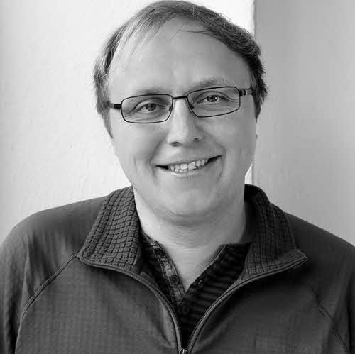
  ## Tino Breddin
  Core Contributor
  > ### **Tino Breddin** *botanicalcarebot.chain* 
  > Tino started his career as a Systems Engineer at Erlang Solutions, where he helped build soft-realtime transaction systems and databases. After serving as Technical Director at Travelping, building the next-generation of SDN-enabled AAA appliances for telecoms, he founded daogames. At daogames, Tino built a scalable multi-tenant infrastructure for multiplayer games used by mobile game developers globally. Currently Tino serves as Chief Architect for AR/VR system development at Vragments, while helping move æternity Core development forward.

- 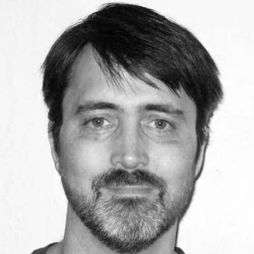
  ## Ulf Wiger
  Core Developer
  > ### **Ulf Wiger** *uwigeroferlang.chain*
  > Ulf Wiger became one of the first commercial users of Erlang when he bought a license in 1993. In 1996, he joined Ericsson and became Chief Designer of the AXD 301 development, arguably the most complex system ever built in Erlang. In recent years, Ulf has been involved in products based on the AXD 301 architecture, and has been an active member of the Open Source Erlang community. In February 2009, he became CTO of Erlang Solutions. He is currently working on æternity blockchain. 

- 
  ## Hans Svensson
  Core Developer
  > ### **Hans Svensson** *hanssv.chain* [g](https://github.com/hanssv)
  > Hans joined the project for the challenge and fun of building a state-of-the-art blockchain in Erlang. With a master's degree in Engineering Physics and a PhD in Computer Science, he previously worked in research, testing and verifying distributed software in Erlang. Hans has consulted for major European companies, including Ericsson and Volvo. Currently he works as a QuickCheck Expert working on contracts and the Sophia language, as well as improving stability and performance during load. His fascination with new technology, and expertise in researching, developing and testing distributed software makes him an excellent addition to our team. Hans would like to see his work contribute to solving hard software development problems for æternity, through designing a versatile, modern blockchain. 

- 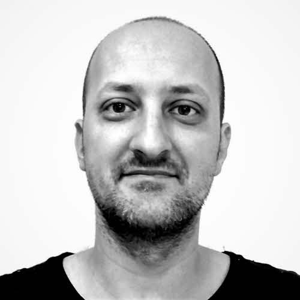
  ## Karol Skocik
  Core Developer
  > ### **Karol Skocik** [y](https://www.youtube.com/watch?v=tLyKHY7-X5A)
  > Karol is freelancing since finishing university, working on web backends, telco, gaming, messaging and crypto areas. He is most proud of introducing Erlang to Gooddata (business intelligence) by writing most of their core services, as well as writing services for signalling emergencies for Everything Everywhere. Most enjoyable personal projects would be a microkernel OS and a realtime strategy game in Lisp & Erlang. He is interested in tech areas (compilers, languages, graph matching/rewriting, AI) but also like to read about history, psychology, business, mathematics and economy.

- 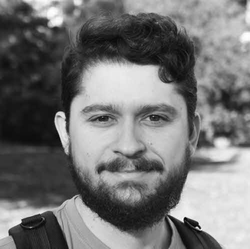
  ## Dimitar Ivanov
  Core Developer
  > ### **Dimitar Ivanov** *dimitar.chain*
  > Dimitar joined the project because he was impressed both by æternity’s balanced approach and the star team of developers already involved in it. With a bachelor’s degree in Software Engineering, he spent a couple of years writing banking software and as a result, now maintains a distinct mistrust of banks. He currently works as a software engineer and has participated in the development of every part of the æternity node. His ability to build rock-solid software, coupled with his fascination for the differences between traditional server software and blockchain (with regard to malicious nodes) makes him a valuable member of the team. He is happy to re-wire his brain to rise to this very interesting challenge. Through this work, Dimitar would like to make the world a better place. 

- 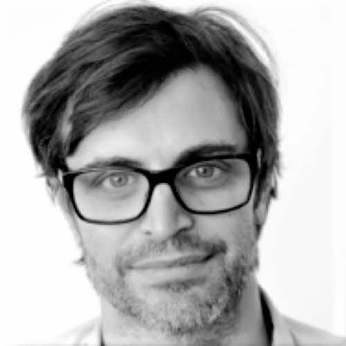
  ## Aleksandar Filipov
  Core Developer
  > ### **Aleksandar Filipov**
  > Aleksandar likes to continuously evolve and learn. In that aspect, there are few places like æternity, where software skills really matter. He considers blockchains as a game changer and as the fundamental new protocol of the distributed world. Aleksandar has been all over, going from real time embedded OS:e where he worked with hardware and matching OpenGL ES drivers, all the way to automotive electrical systems, plus a few years with end-user apps including android apps for banking. Today, he’s a big fan of functional programming, and is a driver for æternity’s “channel services” which is a reference framework showcasing æternity’s unique state channels.
 
- 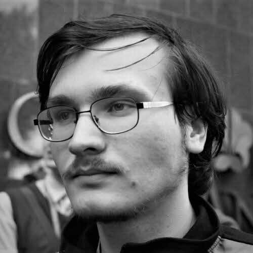
  ## Grzegorz Uriasz
  Core Developer
  > ### **Grzegorz Uriasz**
  > Grzegorz’s fascination with blockchain started when Bitcoin first came out - he carefully tracked the advancements of the technology and amazing projects which were built using it. With a background in cybersecurity and numerical simulations, his love for cryptography, hunting for security bugs in the wild, and analyzing malware in his free time, he decided to join the æternity team and help advance the technology. Excited by scalability challenges, he is currently working on state channels. 

- 
  ## Radosław Rowicki
  Core Developer
  > ### **Radosław Rowicki** *radrowaeternity.chain*
  > Radosław is a fan of programming languages and paradigms, especially functional ones. He did his bachelor's degree at the University of Warsaw in 2019 and joined æternity to fulfill his destiny of compiler construction by working on Sophia. He provides ideas, bug fixes, and introduces new features to the language in the purpose of making it as comfortable to use as possible. He is also the creator of the interactive shell for Sophia which simplifies the process of learning and testing smart contracts. 

- 
  ## Ulf Norell
  Core Developer
  > ### **Ulf Norell** 
  > Ulf is an expert programmer and the brain behind the Agda programming language. He has more than ten years of experience in Erlang. Ulf implemented several challenging parts of QuickCheck and tested Riak, Ejabberd, TCP/IP, Sidejob as well as distributed systems that were deemed difficult to test. He holds a PhD in Computer Science and is an expert in understanding complex scientific papers, as well as implementing their concepts in any programming language. 

- 
  ## Thomas Arts
  Core Developer
  > ### **Thomas Arts** [g](https://github.com/ThomasArts) [in](https://www.linkedin.com/in/thomasarts/)
  > Thomas joined the æternity team because of his desire to learn more about cryptography, software security, and blockchain technology. Holding a PhD in Computer Science and working as a Professor in software engineering, he has over 20 years of experience programming Erlang. Currently, he develops backend code for æternity, whilst writing and analyzing QuickCheck tests, including security analysis and the creation of a threat-model. As a senior computer scientist and Erlang expert, his easygoing and curious nature combine well with his strong mathematical background, allowing him to bring both theoretical and practical experience to the team. Thomas’ analytical skills are invaluable in detecting any errors in the system, thereby increasing the scope and abilities for the future of trustless applications. 
 
- 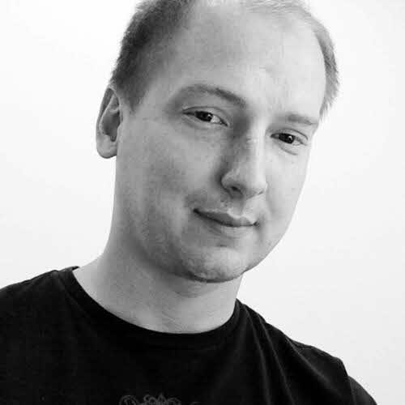
  ## Michal Zajda
  Core Developer
  > ### **Michał Zajda** *transcontinental.chain*
  > Michal joined æternity to take part in the dynamic phase of blockchain evolution. Holding a master's degree in Computer Science, his work background has been focused on the scalability of backend systems that support mobile communication, markets, and IoT. Currently he works as an architect, coordinating æternity's decentralized team of developers that work together to bridge the blockchain world and real-world software capabilities. His experience in navigating the complexity of knowledge around network and state, and his fascination with things like permaculture prime him to organize the self-sustaining capabilities of his work for æternity. By enabling new ways of interacting via state channels, Michal is looking forward to seeing the new value that blockchains will bring to the world. 

- 
  ## Daniela Ivanova
  Core Developer
  > ### **Daniela Ivanova** *danielaivanova.chain*
  > Daniela Ivanova has been working as an Erlang/Elixir developer in Quanterall Ltd since 2016. She is keenly interested in Functional Programming, Blockchain, Distributed Systems, IoT and Software Design. 

- 
  ## Artur Kratt
  Core Developer
  > ### **Artur Kratt**
  > Artur Kratt is an Elixir Developer, currently studying blockchain and associated technologies. Artur believes blockchain innovation is the future of money and economics, and is quickly expanding his understanding and engagement with the field. 

- 
  ## Nikita Fuchs
  Core Developer
  > ### **Nikita Fuchs**
  > Nikita joined the team because he saw it as a chance to create a great protocol for trustless decentralization, fairness, and transparency. Bringing a background in Business Informatics and building production-grade solutions on the Ethereum Blockchain to the development side, he currently works as a Blockchain Application Developer and development coordinator in conjunction with the æpps and core development team. The æternity project benefits from his economics studies which currently amplify his ability to aid the team in the development and creation of various applications, as laws of value are an essential part of blockchain technology. Through this work, Nikita hopes to be able to aid in the creation of a mass-scalable, fair protocol, by the people- for the people.

- 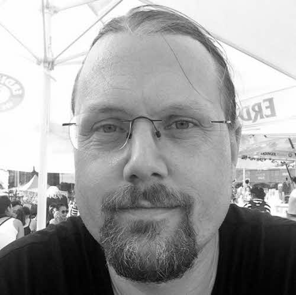
  ## Tobias Lindahl
  Core Contributor
  > ### **Tobias Lindahl**
  > Tobias joined æternity after seeing it as an excellent opportunity to learn more about blockchains. Holding a master's degree in Science in Engineering Physics, he spent five years in academia, doing research in the field of compilers, virtual machines, and static analysis. Tobias currently works as an Erlang developer, involved in most parts of the æternity node, including core functionality as well as the development of virtual machines for executing smart contracts. His expertise in building highly available, robust, fault-tolerant Erlang systems makes him a vital addition to the core team. Tobias sees blockchain as a decentralized counterweight to the current systems of our world and believes that when the two worlds meet, this synergy will create something new and better.

- 
  ## Erik Stenman
  Core Contributor
  > ### **Erik Stenman** [g](https://github.com/happi) [t](https://twitter.com/erik_stenman)
  > Erik joined the project because he finds interesting challenges within constructing a new blockchain and creating an execution environment on top of it. Holding a Ph.D in Computer Science and extensive experience in programming language development for both Erlang and Scala, he has worked with virtual machines for Virtutech and served as the CTO of one of Sweden's most successful fintech startups - Klarna. Currently he is working on smart contracts, languages, and the core of the æternity node. His experience with running a number of small startups in such diverse fields as gaming, real estate, and gastronomy, makes him a valuable addition to our core team. Erik hopes to build a safe and efficient virtual machine for smart contract execution on top of the æternity blockchain.

- 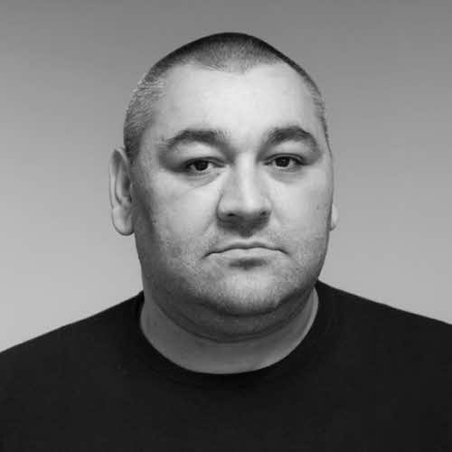
  ## Dincho Todorov
  Technical support
  > ### **Dincho Todorov** *dincho.chain*
  > Dincho joined the project because of his passion for cryptography and excitement to work with a “dream team” of large-scale technology. With a bachelor's degree in Computer Systems and Technologies, and a master's degree in Software Engineering, he has worked in web and mobile development and as the CTO of both a web startup and a mobile development agency. Currently working in SRE, he is responsible for configuring, running and deploying our testnet/mainnet/dev environments. His expertise in networks, web, and mobile make him uniquely suited to helping the team build better products. Through his work, Dincho would like to see the development of fully autonomous processes, contribute to a great user experience, and ultimately provide an innovative, secure, and stable technology. 

- 
  ## Milen Radkov
  Technical Lead
  > ### **Milen Radkov** *milenradkov.chain*
  > Milen is a blockchain developer and enthusiast, software engineer and entrepreneur who started his blockchain journey as a miner. Since the beginning of 2019, he has also been part of the European Commission Blockchain Experts representing Bulgaria. He is the founder of hack.bg, focused on developing products, smart contracts, decentralised apps, and consulting for complex software systems and the blockchain space. Milen is also the organiser of several blockchain-related technological meetups in Bulgaria. He joined the development team responsible for the waellet browser extension and later on became involved in the specification of different standards. He is currently leading the development of Superhero.

- 
  ## Keno Dreßel
  Superhero Developer
  > ### **Keno Dreßel** *kenodressel.chain*
  > Keno Dreßel started his software career 13 years ago with web development. Since then, he completed a bachelor's and master's degree in computer science and has been working on various full stack projects after this. After his studies, he moved to freelance fullstack projects and joined æternity development in 2018. He developed his interest in blockchain in 2015 and has been an avid user and supporter of the technology since. 

- 
  ## Philipp Piwowarsky
  Superhero Developer
  > ### **Philipp Piwowarsky** *philipp.chain*
  > Fascinated by the vision, ideology, and technology of æternity, Philipp joined to take part in developing the future of blockchain. As a full stack software engineer, his previous work included full-stack development and system administration in various functional and object-oriented languages. He currently works as a Blockchain Engineer, managing the technical and logistical aspects of multiple projects within the organization in an effort to provide a blockchain platform on which others can easily integrate their products. Philipp’s passion for self-sovereignty and the empowerment of individuals makes him a great fit for introducing more developers to the blockchain world.

- 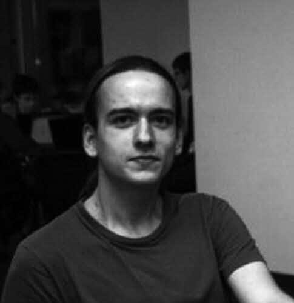
  ## Denis Davidyuk
  Superhero Developer
  > ### **Denis Davidyuk** *davidyuk.chain* [g](https://github.com/davidyuk) [in](https://www.linkedin.com/in/denis-davidyuk-9a9330141) 
  > Denis joined the team because he saw it as an opportunity to learn how to solve complex technical challenges. Having studied at the Far Eastern Federal University with a bachelor's degree in Applied Mathematics and Computer Science, he began building web applications using modern web technologies. Currently working as part of æternity's aepps development team, his focus is on refining and optimizing the Superhero wallet. His previous work in building decentralized applications helps him  make accurate technical decisions. Although Denis believes that scalability is the most significant problem that this technology currently faces, he also believes that æternity can solve it.

- 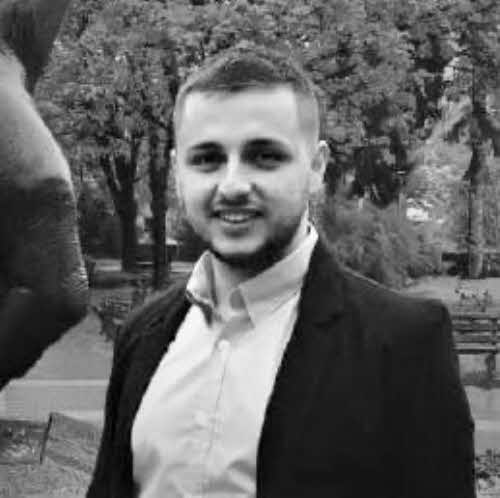
  ## Valentin Angelov
  Superhero Developer
  > ### **Valentin Angelov**
  > Valentin is a full stack developer. Joined aeternity because of his interest in blockchain technology, and was initially a part of the waellet development team. He is now working on Superhero.

- 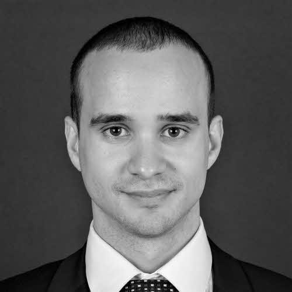
  ## Stanislav Slavov
  Superhero Developer
  > ### **Stanislav Slavov**
  > Stanislav is a front-end developer with 5+ years of experience in developing scalable enterprise web applications and collaboration tools. He is adept in Agile, experienced in international and distributed team environments, passionate about English literature, as well as running and computer games.

- 
  ## Petar Baykov
  Superhero Developer
  > ### **Petar Baykov**
  > Petar is a full-stack web developer currently working on the Superhero wallet and other parts of the project. He is currently completing his bachelor’s degree in Computer Science.

- 
  ## Nikita Tsedrik
  Superhero Developer
  > ### **Nikita Tsedrik**
  > Nikita has a master's degree in Applied Mathematics and Computer Science. He is an enthusiastic learner, currently in the process of earning his PhD. After participating in a recent blockchain Hackathon, Nikita created a Ledger app for æternity and is currently working as a developer for the æpps team, focusing on refining both the Ledger and base-æpps. Nikita’s background in AR/VR and image recognition primes him for understanding how this technical medium can intersect with its human users. Nikita is fascinated by the limitless potential of blockchain. 

- 
  ## Dmitry Kostin
  Superhero Developer
  > ### **Dmitry Kostin** *paradise.chain*
  > Dmitry was educated with capability to solve problems on any language or framework. He found the idea of decentralized applications—widely used in cryptocurrency projects—very interesting for testing his skills. After more than a year of supporting the development of the Base Aepp, connecting it with other wallets and improving ease of use for dApp developers, he seeks to further improve cryptowallets and expand their usage. 

- 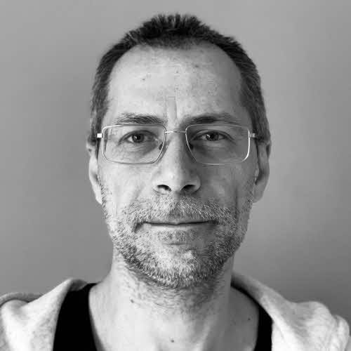
  ## Ivaylo Badinov
  Design Lead
  > ### **Ivaylo Badinov** *jeanlucpicard.chain* [g](https://github.com/venimus) [in](https://www.linkedin.com/in/badinov/)
  > Ivaylo has 20 years of experience in development from scratch of multiple business, educational, and social platforms for various established companies and start-ups. Although having a master's degree in Electronics, he chose to work in the software development field. He first joined æternity in June 2019 as Site Reliability Engineer and later pivoted as a front-end developer and Lead for designers. He also maintains the æternity.com website and manages operations for Superhero.

- 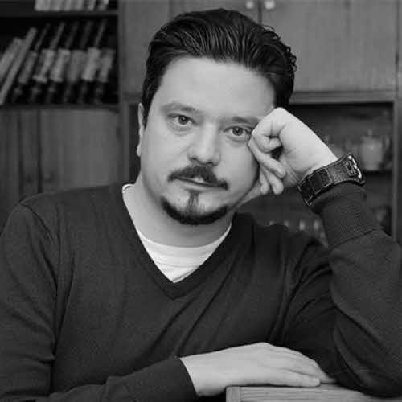
  ## Tsvetan Kolev
  Senior Designer
  > ### **Tsvetan Kolev** *tsvetan.chain* 
  > Tsvetan is a Sofia-based web and visual designer focused on UI/UX, implementing the best practices of user-centered design in his work. He has over 10 years of experience in the design field, ranging from digital agencies and personal clients to product companies. He is excited about blockchain technology and its disruptive potential for innovation and transformation of different sectors of the global society and economy. He considers blockchain to be one of the leading technology trends defining the next decade and further. This particular interest led him to discover æternity blockchain, joining the team in the end of 2019 as a Senior Designer. 

- 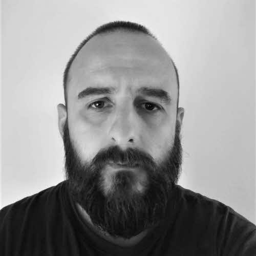
  ## Boris Bolonjek
  Designer
  > ### **Boris Bolonjek** *dubbwise.chain*
  > Boris is a senior full-stack product designer with experience in automotive, blockchain, gaming, productivity, no-code, edu, and fintech startups.

- 
  ## Leah Stuhltrager
  Interim CMO
  > ### **Leah Stuhltrager**
  > Leah Stuhltrager has developed, managed, and marketed ART::TECH projects for over 20 years. Career highlights include leading projects for high-profile venues around the globe, campaigns with brands leading their industries, curating esteemed events, as well as community initiatives building industry bridges between America, Europe, Asia.

- 
  ## Cecille De Jesus
  Head of Communications
  > ### **Cecille De Jesus** *theScientress.chain*
  > Cecille is interested in the social impact of blockchain and technology in general, particularly how decentralization can reduce inequalities—how it can change the dysfunctional ways of modern society. Before becoming part of the æternity community, she taught visual communication as well as UI/UX in colleges in the Philippines. Her background covered communications strategy, art direction, campaigns, and was a project manager and author for science and tech website Futurism. She is absolutely honored to be part of æternity, a solid project backed by rigorous research from an exceptionally talented league of programmers and a genuine drive to deliver technology for a better world. She currently works as Head of Communications.

- 
  ## Liubov Sharga
  Growth Hacker
  > ### **Liubov Sharga** *sinonimboga.chain*
  > Liubov is an experienced marketing professional with expertise in the digital marketing area. For the past years, she has been working with blockchain startups. She was also involved in the preparation and presentation of blockchain conferences around the world. Passionate for what she does as a lifestyle, Liubov is interested in innovations that bring real benefits to business. She is impressed with the whole range of opportunities that æternity's technology offers the world and its practical implementation. Her goal is to involve more and more people to use the unique technologies that æternity provides. 

- 
  ## Mark Le
  Chinese Community Manager
  > ### **Mark Le**
  > Mark believes in the full scope of the æternity blockchain and felt joining the team would be the most direct way to  promote an æ ecosystem within China. With a bachelor's degree from the Harbin Institute of Technology, Mark has experience as both the Overseas Distribution Manager in CHINT and PR Manager in Geely. Currently, he works as æternity's Chinese Community Manager, interfacing and coordinating with the Chinese community; making real-time connections between the æternity team and the community in China. His work in mining, promoting, and marketing make him the ideal person to engage the Chinese community. Mark hopes that through his work, he will be able to help establish a powerful æternity ecosystem in China.
 
- 
  ## José Frugoni
  PR and Social Media Management for Americas
  > ### **José Frugoni**
  > José Frugoni is part of the communications team of æternity Americas. As a professional journalist, he has worked in radio, television, and the press, specializing in the development of digital platforms. He has been linked to digital projects for business and communication platforms for more than two decades. José worked as an editor at Terra Networks Uruguay and Spain, coordinated the digital newsroom of Radio El Espectador and is a web editor for the Uruguay Semanario Búsqueda. He currently lives in Montevideo.

- 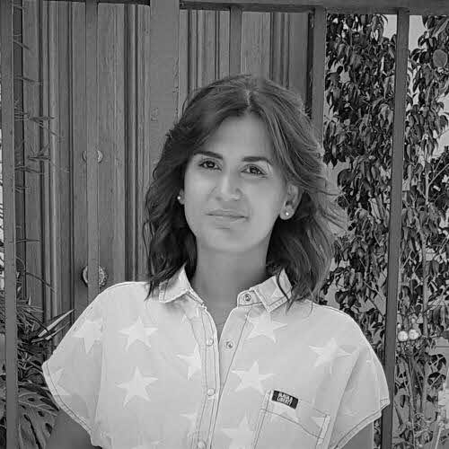
  ## Mariana Sanguinetti
  Public Relations Director
  > ### **Mariana Sanguinetti**
  > With a background in Business Development, Mariana works for the expansion of æternity blockchain in Americas as part of the Americas Team, co-creating new business solutions based on blockchain, such as traceability. She feels blockchain is the future that is already here. æternity blockchain offers a safe, scalable  way for companies to switch to this new technology and her role is to enable this happening. As Public Relations Director, Mariana creates innovative experiences for people that are in contact with the æternity brand at events, gatherings, and meet ups, helping expose the use of this technology in an understandable and entertaining way.

 - 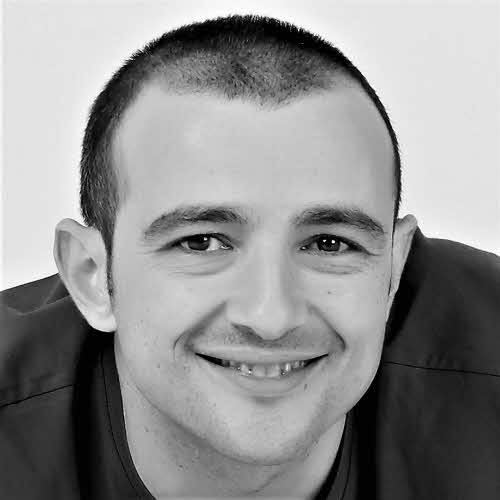
    ## Alex Casas
    Ecosystem Lead
    > ### **Alex Casas**
    > Alex was an early member of the æternity community since he knew the project in March 2017 and realized his alignment with the vision and technological potential of æternity blockchain. He has been devoted to the BPO/ITO industry related to Business development, operations, and management roles for over 17 years, scaling a company from scratch to 3.000 employees and 13 facilities in 4 countries in two years as its general manager. Passionate about blockchain potential to achieve a more balanced and fair world, he has founded or co-founded several social impact initiatives, some to be built on the æternity network. As a highly committed and hard worker, he is supporting the æcosystem growth, product development and operations to contribute together with the team to the mass adoption of æternity.

- 
  ## Erik Vollstädt
  Æmbassador Manager
  > ### **Erik Vollstädt** *erikvollstaedt.chain*
  > Erik joined the team because he saw æternity’s potential to improve on Ethereum and Bitcoin's deficits through state channels and functional programming languages like Erlang and Elixir. With a master's degree in Science in Business Innovation & Technology Management from Girona, Catalunya, he has experience in lead generation for apps marketing, product testing and content editing and has worked as the Co-Founder and Community Director of Bitnation. Currently working as æmbassador Manager, he coordinates and engages community feedback and ambassador collaborations both on and offline. Erik ultimately hopes to counteract to the abuse of power by politicians and the banking sector by growing æternity’s user base and expanding the projects’ reach, worldwide. 

- 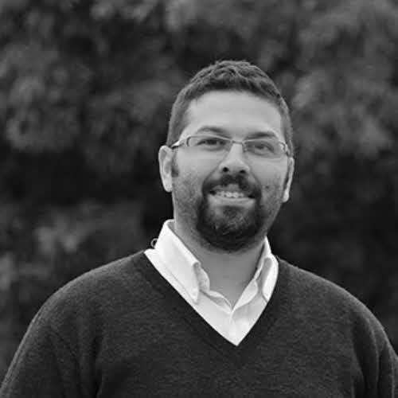
  ## Omar Saadoun
  Developer Æmbassador Manager
  > ### **Omar Saadoun**
  > Omar Saadoun is a software engineer working on technology since ever. He worked as CEO of INMIND for many blockchain projects and discovered the full potential to unlock meaningful and real life projects in æternity. As technical lead of Americas, he is in touch with startups and companies to lead them in getting the best from æternity and make their technology succeed.

- 
  ## Albena Kostova
  Superhero Aficionado
  > ### **Albena Kostova**
  > Albena joined the team with a fascination for blockchain technology and its potential to change how we conduct our lives. Holding a bachelor's degree in European Studies and a master's degree in Entrepreneurship, she brings her experience in Information Services, Due Diligence, and Anti-Money Laundering Services. Currently focusing on outreach to expand mainstream use through Superhero, Albena is responsible for onboarding new users to the platform. Through her work, Albena is pushing to grow the community worldwide at a massive rate, and to deliver a free and fairer Internet to those who need it the most through æternity technology.

- 
  ## Helmut Müller
  Æternity Labs CEO
  > ### **Helmut Müller**
  > Helmut joined the team with a desire to get the word out about æternity’s fascinating work and state of the art blockchain. Having studied business, entrepreneurship and mechanical engineering, Helmut worked as a strategy consultant, and general manager for UK's fastest growing e-commerce startup and has been closely involved with the blockchain sphere since 2012. Currently he handles day-to-day marketing team alignments, focusing on process analysis and improvement. His previous work in strategy consulting helps him to analyze these processes to define strategy for better execution. Through this work, he would like to reestablish trust with the wider public regarding blockchain technology and blockchain funding, as well as contribute to more widespread usage of æternity blockchain.

- 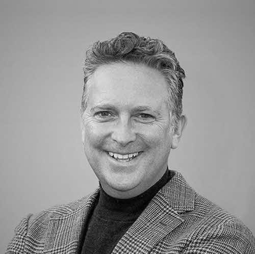
  ## Magnus Maynard
  Head of Alliances
  > ### **Magnus Maynard**
  > Magnus believes æternity is taking Blockchain to the next level, mass adoption. With an extensive background in advanced technologies and system integration across EMEA, Asia Pacific and North America; Magnus sees æternity Blockchain as the leading light in revolutionising business practice. Having personally led integration businesses and their clients from digital to IP & streaming, Magnus is now focussed on assisting æternity partners and their clients in bringing Blockchain into relevant aspects of their business. With a fundamental belief in decentralised principles, Magnus was attracted to æternity due to its progressive thinking around this area, not only in its offering but the way of life it provides. Magnus also believes that æternity provides an unprecedented opportunity to assist the evolution of business through blockchain.

- 
  ## Gonzalo Sobral
  Enterprise Lead Æmbassador
  > ### **Gonzalo Sobral**
  > Gonzalo has a degree in Communication and a master's degree in Business Administration. For the last 20 years he has been working as Business Developer and Consultant in Digital Transformation in companies related to Data Science, Blockchain and Digital Marketing. He developed his journalistic career in radio, written press, TV and web during the last 35 years. He also teaches Innovation, Ethics and Corporate Communication at University.

- 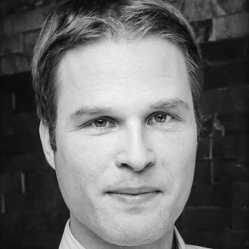
  ## Ingmar Zechlin
  COO
  > ### **Ingmar Zechlin**
  > Ingmar joined æternity because of his love for innovation on many levels which is embodied by æternity in  an outstanding way. He has a track record in change management and new technologies like digital  analytics,  data science and IoT, always focusing on business strategy on one hand and coordinating the  execution on the other. In his role as COO of æternity, he leads the overall operations team, including  Operations, legal, hr and finance with the aim to support the æternity project on its great journey into mainstream.

- 
  ## Tina Miao
  Operations Manager
  > ### **Tina Miao** *freelikeabird.chain*
  > Tina joined æternity on seeing blockchain’s massive potential to disrupt the status quo of many industries. Holding a Bachelor’s degree in Engineering and a Master's degree in Computer Science, Tina has more than 15 years’ experience driving challenging IT projects in logistics, telecommunications and the medical device industry. Currently working for the æternity Crypto Foundation and development for the Asia-Pacific region, she also handles AE token listings. As a global citizen, she has worked in Australia, China, India, Malaysia, Switzerland and is now based in Liechtenstein. Technological advancements that facilitate scalability, transparency, and privacy truly excite Tina, and she would like to contribute to æternity becoming the blockchain with the largest worldwide adoption.

- 
  ## Olga Polishchuck
  HR Manager
  > ### **Olga Polishchuck**
  > Olga is an HR Manager at æternity Establishment since 2019, where she is responsible for various HR and Recruitment processes. Prior to joining æternity team, she has collaborated with different startups from recruitment agencies to software companies. Broad experience in international IT recruitment and HR brought  her to work with æternity team on a fascinating blockchain project. People at æternity trying to solve real-world problems using blockchain technologies, and Olga is fascinated to be part of the community, hire the right talents and help to tokenize the world.

- 
  ## Thomas Nägele
  External Legal Advisor
  > ### **Thomas Nägele**
  > Thomas Nägele, Attorney at Law at NÄGELE Attorneys at Law LLC, focuses on legal advice in the area of IT law. The handling of legal advice surrounding blockchain technology requires both legal expertise and knowledge of IT, two areas in which Mr. Nägele undoubtedly possesses the requisite skills. Outside of his formal legal education and numerous years of experience in the legal industry, and his knowledge in the area of IT is unsurpassed; witnessed by his continued involvement in software programming over the past 10 years, combined with his involvement with Bitcoin and Blockchain technology since 2011. Thomas also advises clients in international finance, technology and industrial enterprises, operating in the fields of Blockchain/DLT, telecommunications and internet, as well as public institutions. Besides being Attorney and legal Advisor, he teaches at the University of Liechtenstein, giving lectures and presentations on the newest legal developments. Serving as co-founder of the CCA, Mr. Nägele can be viewed as responsible for numerous developments regarding information technology within the county.

- 
  ## Georgi Matev
  External Legal Advisor
  > ### **Georgi Matev**
  > Georgi Matev is a corporate lawyer, specializing the laws and regulations surrounding the state of blockchain and fintech technology on a local, EU and international level. He is Partner and Head of Blockchain and Innovation competence group of Rashev and Partners Law Firm, Bulgaria. He is a founding member and Chairman of the Balkan Blockchain Association, as well as a member of INATBA WG finance. Further, he is a member of the Bulgarian Governmental Blockchain working group, which is entitled to investigate blockchain applicability in the public and the financial sector and analyse the need for adoption of a blockchain related legislation. He was also among the founders and а Board member until 2017 of the Bulgarian Bitcoin Association.

- 
  ## Viktoriya Veleva
  External Legal Advisor
  > ### **Viktoriya Veleva**
  > Viktoriya Veleva is a legal consultant, taking an active part in the Blockchain and Innovation competence group of Rashev and Partners Law Firm, Bulgaria. She is the legal advisor of the Balkan Blockchain Association, situated in Sofia, Bulgaria. Ever since her first steps in the legal world, Viktoriya has had profound interest in the spheres of technological innovations and decentralized finance, tackling regulatory questions on local, regional and international levels. She is competent on the topics of digital security, crypto-asset legal frameworks, AML measures and DLT. Viktoriya believes that in a world which is so digitally-focused, the development of a digital single market is inevitable and the enhancement of innovations and technologies is of crucial importance.

- 
  ## Marco Walz
  Stuttgart æmbassador
  > ### **Marco Walz** [g](https://github.com/marc0olo) [t](https://twitter.com/marc0olo) [in](https://www.linkedin.com/in/marco-walz-776844141/)
  > Marco is a software developer (full-stack) with a strong drive to make everybody's life more comfortable. He got interested in blockchain and cryptocurrencies in the spring of 2017. In early 2018, he co-founded Kryptokrauts which develops SDKs and tools for the æternity ecosystem. 

- 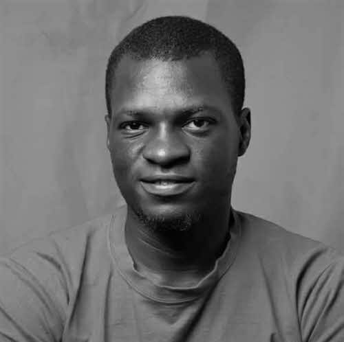
  ## Stephen Sunday
  Lead æmbassador Nigeria
  > ### **Stephen Sunday** [t](https://twitter.com/steviekusu) [in](https://www.linkedin.com/in/stephen-sunday-kusu-8673a6173/)
  > Based in Jos, Nigeria with a background in Computer Science, Stephen is a crypto enthusiast who runs a blockchain consulting firm called KusuConsult. Stephen has a passion for promoting blockchain-related grassroot projects and gets regularly invited as a speaker for blockchain events in Nigeria. Stephen has led some of the most successful æmbassador meet-ups, tapping on developer groups and local communities. 

- 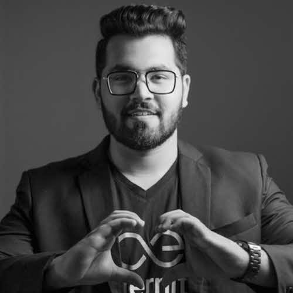
  ## Ashish Chawla
  Lead æmbassador India
  > ### **Ashish Chawla** [i](https://www.instagram.com/ashii_chawla/)
  > Ashish has long been a supporter of the æternity community. He started out by joining the æmbassador Program, working his way up as a Lead æmbassador after having proven his dedication to the growth of the ecosystem. A keen social media expert with knowledge of the different facets of new-age digital media, Ashish is truly a rare talent, especially considering his very young age of 23. Ashish wants to take the social media engagement of Superhero and æternity to a whole new level and set the benchmarks higher for overall online presence. Hailing from India, Ashish art directs visuals primarily for Superhero and is dedicated to improving communications for æternity through expressive media.

- 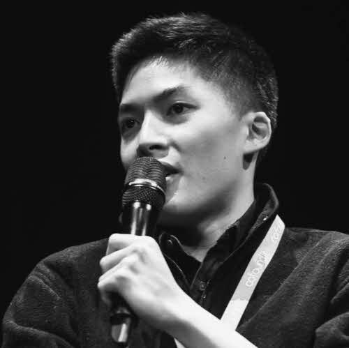
  ## Justin Kat
  Montreal æmbassador
  > ### **Justin Kat** [g](https://github.com/Jkat) [in](https://www.linkedin.com/in/justinkat/)
  > Justin has a background in economics and software engineering and is currently working as a blockchain consultant. He organizes workshops focusing on smart contract development.

- 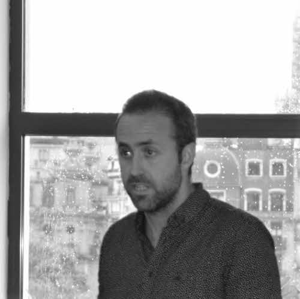
  ## Manel Ruiz
  Lead æmbassador Spain
  > ### **Manel Ruiz** [t](https://twitter.com/manelomanu)
  > Manel Ruiz has a strong background as a social activist in Catalonia. He saw cryptocurrencies as the right path to follow for humanity go further in a more connected and free world. As a passionate educator, he likes to share the possibilities that Blockchain technology can offer to everyone. 

- 
  ## Emmanuel Joseph
  Lead æmbassador Ekiti
  > ### **Emmanuel Joseph** [g](https://github.com/emmanuelJet) [t](https://twitter.com/emmanuelJet_) [in](https://www.linkedin.com/in/jet774/)
  > Emmanuel Joseph (JET) is a full-stack web developer who loves using Google and æternity tools in software development. His vision to impact young minds and his love for community building got him to lead the Developer Student Club, for Ekiti State University, Nigeria and also ækiti æmbassador. Jet has been a very active part of the community and remains one of the strongest driving forces in æternity's community growth.

- 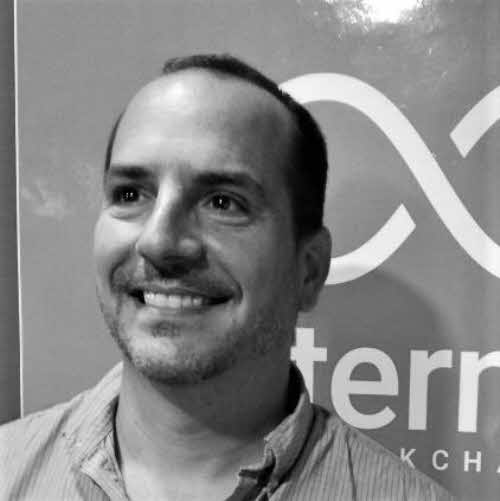
  ## Juan Carlos Delpino
  Lead æmbassador Venezuela
  > ### **Juan Carlos Delpino** [in](https://www.linkedin.com/in/juan-carlos-delpino-s-062a1829/)
  > Juan Carlos is an entrepreneur and developer of new businesses, leveraging his engineering knowledge and marketing experience. He has worked with industry giants, managing the telecom market for LG Electronics, and has founded several businesses as well as a national franchise. He is a founding member of the National Cryptocurrency Association (currently a vice president) and authored the book titled, "From zero to making money with cryptocurrencies".

- 
  ## Owen O’Driscoll
  Lead æmbassador Ireland
  > ### **Owen O’Driscoll** [in](https://www.linkedin.com/in/owen-o’driscoll-722b6a90/)
  > Emerging as a proactive entrepreneurial spirit, he launched his career as a self employed restaurant owner. Ten years later his insatiable thirst for knowledge drove him to the blockchain space, which is now his main focus. His extensive business expertise and operations experience aids in the introduction of traditional operations to emerging technologies and vice versa.

- 
  ## Arjan van Eersel
  Lead æmbassador Bulgaria/Baltics
  > ### **Arjan van Eersel** [in](https://www.linkedin.com/in/arjanvaneersel/)
  > Arjan van Eersel comes from the world of corporate services and has been a consultant for international businesses and taxation for many years. During the same time, he was also coding for internal open-source software projects. Now with his business domain knowledge and coding experience, he runs a company working on delivering software, which uses modern technologies such as blockchain and self-sovereign identity for the corporate services sector. He currently propels the æternity community in Bulgaria and the Baltics.

:::

::: slot buttons

- [Edit this site](https://github.com/aeternity/web-dev/edit/master/index.md)

   Create a PR

:::

</Section>

<ClickableElements selector="#team_members li" excludeSelector=".active blockquote"/>
<Randomize selector=".team > ul"/>

<Section id="who">

## Here are some projects that use æternity

<input type="checkbox" id="more-logos">

- [*Superhero.com*](https://superhero.com)
    Tip content creators and any public URL
- [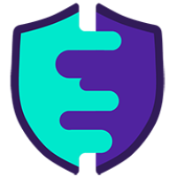*Airgap*](https://airgap.it)
    Secure wallet
- [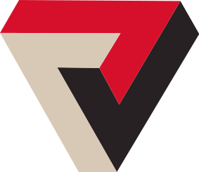*Vereign*](https://www.vereign.com)
    Email and documents security
- [*Lexon*](http://lexon.tech)
    Human readable programming language
- [*JELLY*](https://jelly.market)
    Atomic swap
- [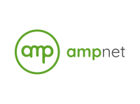*AMPnet*](https://ampnet.io)
    Software and exchange for electricity cooperatives
- [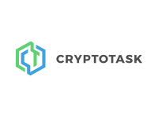*Crypto Task*](https://beta.cryptotask.org)
    On-Event payment and ticketing platform
- [*Smart credit*](https://smartcredit.io)
    Crypto loans
- [*AEknow*](https://aeknow.org)
    Æternity Explorer
- [*ReCheck*](https://recheck.io)
    A platform for secure data storage and exchange
- [WEIDEX](https://weidex.market)
    Multichain decentralized exchange
- [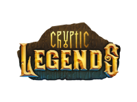Cryptic Legends](http://crypticlegends.co)
    Mobile game
- [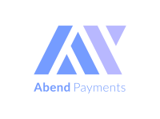Abend](https://abendpayments.com)
    On-Event payment and ticketing platform
- [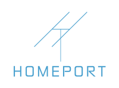Homeport](https://homeport.network)
    Marketplace for data from space satellites and ground stations
- [RIDESAFE](https://www.ridesafeafrica.com)
    First aid insurance for motorbike riders in Africa
- [UTU](http://protocol.utu.io)
    Trusted Recommendation Service
- [Assetify](https://www.assetify.net)
    Platform to enable lending institutions to accept crypto assets
- [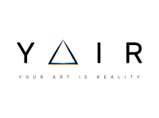YAIR](https://yair.art)
    Platform for tokenization of media artwork
- [Arkane](https://arkane.network)
    Wallet as platform for blockchain apps
- [King Football](https://kingfootball.com)
    Verify football merchandise authenticity
- [Crowdholding](https://www.crowdholding.com)
    Crowd funding

<label for="more-logos">Show more</label>

</Section>

<Particles id="particles-who" />

<Section id="news">

## News & Updates

<Topics id="announcements" category="announcements" :pinned="true" :count="3" :show-meta="true"/>

</Section>

<Randomize selector="#who ul"/>
<ClickableElements selector=".ribbon > ul > li" excludeSelector=".ribbon > ul > li a" />
<CardsCounter />
