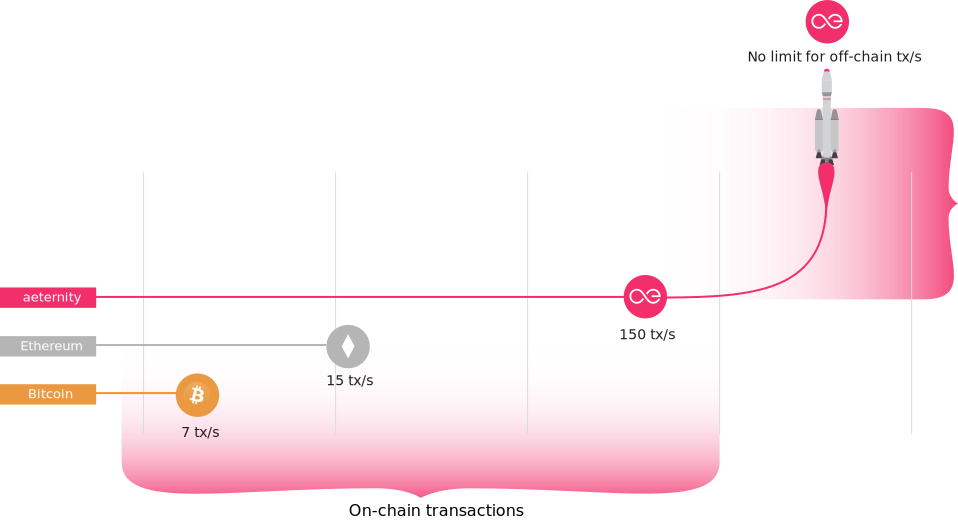
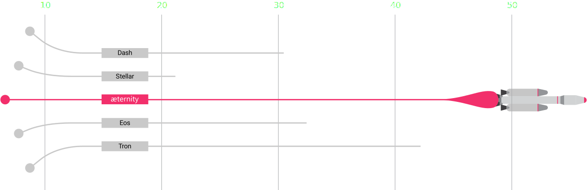
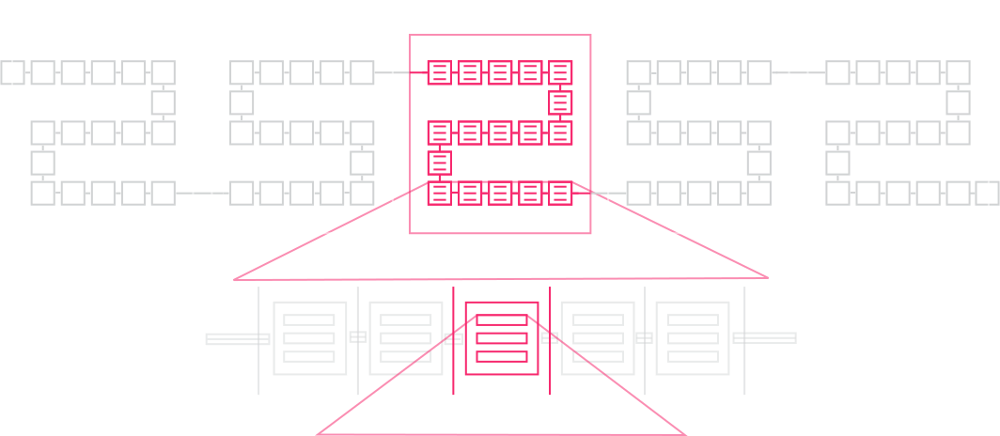
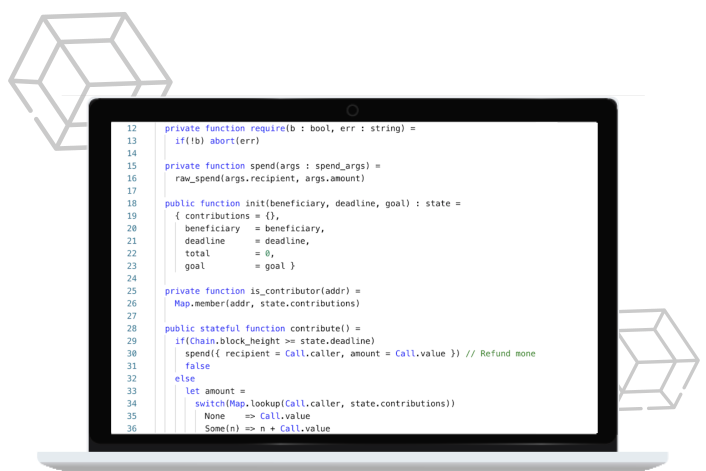
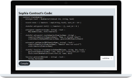
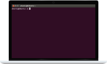
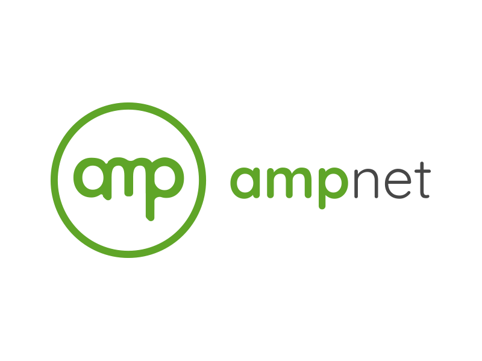
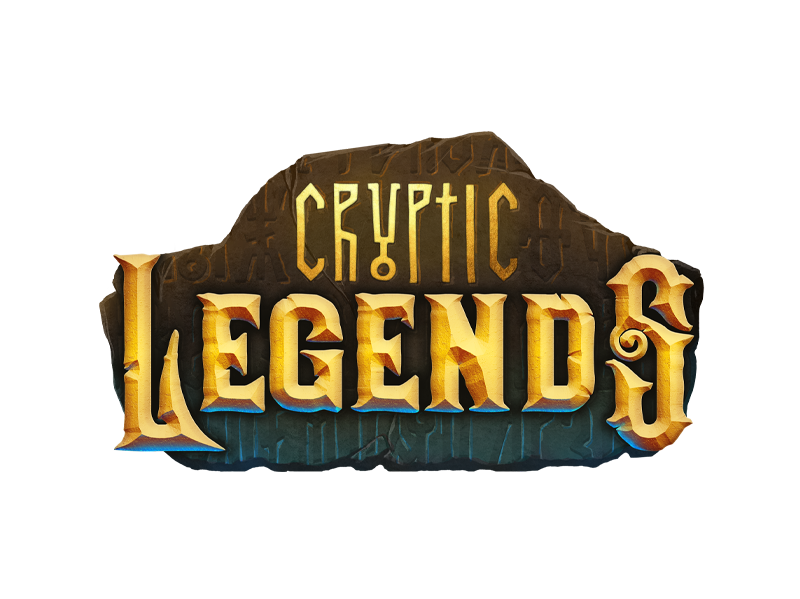

<Section id="header" type="hero">

<video autoplay loop muted playsinline onload="this.play()" preload="metadata">
  <source src="./img/background.mp4" type="video/mp4">
</video>

# A Blockchain for scalable,<br> secure and decentralized æpps

::: slot buttons

- [Get started](#getting_started)
- [Get involved](#community)

:::

::: slot bottom
<Metrics/>
:::

</Section>

<Section id="innovative">

## Why æternity is so innovative?
æternity blockchain is an Erlang-based scalable smart contract platform engineered by programming pioneers to address some of the most fundamental challenges native to earlier blockchains. 
By redesigning blockchain technology at the protocol level, the æternity developer community has enabled the core protocol to understand and integrate a rich set of functionalities out of the box.

::: slot ribbon

-  Smart contracts
  - ### Smart contracts: Sophia
    æternity smart contract programming is unique: Sophia is a typed functional programming language in the ML family that makes it easier to write correct programs.

    [Read more](https://aeternity.com/documentation-hub/protocol/contracts/sophia/)
-  FATE VM
  - ### FATE Virtual Machine: faster, simpler, safer code
    The Fast æternity Transaction Engine, or FATE VM, uses a higher level of abstraction and automatically minimizes error with type checking, delivering a simpler, easier, safer programming environment.

    [Read more](https://github.com/aeternity/protocol/blob/e2940192379916fb21a053b3ab09d1dff2ac76ef/contracts/fate.md)
-  Advanced State Channels
  - ### Advanced State Channels Technology
    Unlike most blockchains, æternity’s core protocol was re-engineered specifically so it can accommodate state channels on a protocol level, making it easier to build applications for global-scale enterprise use cases 

    [Read more](https://aeternity.com/documentation-hub/protocol/channels/)
-  Oracles
  - ### Oracles
    æternity Oracles enable the integration of real-world data into the blockchain—a feature that has an endless range of potential use cases for business, science, and all other industries across the globe.

    [Read more](https://aeternity.com/documentation-hub/protocol/oracles/oracles/)
-  Unique governance
  - ### Unique governance
    Miners are not the only ones who get a vote on decisions—æternity token holders can use their AE tokens to signify their vote through the Governance Aepp.

    [Read more](https://github.com/aeternity/aepp-governance)
-  Naming system
  - ### Naming system
    The æternity Naming System (AENS) employs safe human-readable names in place of the current system of long hashes used in blockchain transactions, reducing room for error for users.

    [Read more](https://aeternity.com/documentation-hub/protocol/AENS/)

:::

</Section>
<Section id="brief_history">

## History

- **2016** initial company forms in Liechtenstein
- **2017** crowdfunding over BTC and ETH
- **2018** æternity Mainnet blockchain launch
- **2019** æternity universe ecosystem and first tokens on æ
- **2020** forecast a million æpp transactions, by legal blockchain entities

</Section>
<Section id="technical_advantages" type="fancy">

<video autoplay loop muted playsinline onload="this.play()" preload="metadata">
  <source src="./img/background.mp4#t=29" type="video/mp4">
</video>

## Technical advantages

- 
  No scaling limits with built-in trustless, off-chain State Channels
- 
  Highest security standards with a type-safe VM and functional Smart Contract language
- 
  ~3 second block confirmation times
- 
  Low on-chain fees due to highly optimized consensus, VM, and native transaction types
- 
  No off-chain fees for transactions and Smart Contract execution in State Channels
- 
  Built-in Naming System for human-readable names
- 
  Private transactions and smart contracts in state channels
- 
  Built-in Oracles for accessing external API’s and real world data
- 
  Highly flexible generalized account model supporting all types of signing options

>  
> 
> Reference implementation written in Erlang by industry experts, the language that powers 90% of today’s world wide web. [Learn more](https://en.wikipedia.org/wiki/Erlang_(programming_language))

</Section>

<Section id="state_channels">

## State Channels

State channels make it possible to execute smart contracts off-chain. The blockchain enforces the 
smart contract code, only in the case of a disagreement between the contracting parties. 

::: slot bottom



> ### State Channels
> 
> æternity can scale to billions
> of transactions with off-chain
> State Channels. [Read more](https://aeternity.com/documentation-hub/protocol/channels/)

:::

</Section>

<Section id="inner_workings" type="fancy">

## Less noise. More work.

Featured in Electric Capital’s Report for being among the projects with the most committed developers per month — over 50. It is also noted that æternity has an impressive amount of dev activity ranking top 5 according to Santiment.



> 1/31/2018 - 1/31/2019 -- Electric Capital Internal Data.
> Excluding private repositories.

## The structure of æternity



</Section>

<Include path="sections/protocol" />

<Particles id="particles-protocol" />


<Section id="assets">

## Use cases
* Documents, contracts, invoices, receipts
* Decentralized Finance (DeFi) 
* Payments, Loans, Shares
* Decentralized autonomous organization (DAO)
* Votes
* Identity
* IOT blockchain identities. HARDWARE
* Games

::: slot cards

- ### FUNGIBLE TOKENS
  * In Game Points
  * Stable Coins
  * Loyalty Points
  * System Credits
  * Cryptocurrencies
- ### NON-FUNGIBLE TOKENS
  * In Game Items
  * Supply Chain
  * Real Estate
  * Identity
  * Certifications
  * Collectables
- ### RESTRICTED FUNGIBLE TOKENS
  * Securities
  * Government Issued Fiat
  * Certifications
- ### RESTRICTED NON-FUNGIBLE TOKENS
  * Real Estate
  * Ownership Registries
  * Regulatory Certifications

:::

</Section>

<Section id="sophia" type="alt">

## Safe Smart Contracts with Sophia
Sophia is a functional Smart Contract language in the ML family. It is strongly-typed and has a restricted mutable state. Sophia is a Ocaml-like language with syntax mostly resembling that of Reason.

::: slot body

<div class="sophia-content">
    <div class="sophia-graphic">
        
    </div>
<div class="sophia-text">

### What is Sophia?
 The Sophia language was created to easily utilize the potentials of the æternity protocol. Some features of conventional languages, such as floating point arithmetics for example, are not present, while some blockchain-specific primitives, constructions, and types have been added.

### Links
- [Documentation](https://github.com/aeternity/aesophia/blob/lima/README.md)
- [Examples on GitHub](https://github.com/aeternity/aepp-sophia-examples)
- [Code Highlighting](https://marketplace.visualstudio.com/items?itemName=MilenRadkov.sophia) for VSCode and other IDE’s

### Educational material
 [Online Course from Dacade.org](https://dacade.org/ae-dev-101/introduction)<br>
Check out the highly recommended æternity 101 course on Dacade, a peer learning platform.
Courses are free and you will be given a certificate upon completion.

### Community materials
  - [Sophia course (Basic)](https://drive.google.com/file/d/1NIhiVcByLmg9VcTcHqxcVo7oT112Bz2O/view?usp=sharing) (.pdf) - ORT university in Montevideo, Uruguay
  - [Sophia course (Intermediate)](https://drive.google.com/file/d/1k6vAWLLDePMaOX5-hD69JIKpDWqTuXf3/view?usp=sharing) (.pdf) - ORT university in Montevideo, Uruguay

</div>
</div>

:::    

::: slot buttons

- [Get help](https://forum.aeternity.com)

   in the Forum

:::

</Section>

<Section id="getting_started" type="fancy">

<video autoplay loop muted playsinline onload="this.play()" preload="metadata">
  <source src="./img/background.mp4#t=39" type="video/mp4">
</video>

## Getting started

In order to get started, try out the community developed online IDE or setup your own development environment with the local development framework AEproject.

- ###  Try it in the browser
  Start writing and testing Sophia Smart Contracts instantly. Click on the link below to launch the Contract compiler.
  - 

    [Contract compiler](https://contracts.aepps.com)

- ###  Try it locally
  Use AEproject to set up your local development environment in minutes.
  ```
  npm i -g aeproject
  ```
  - 

    [AEproject](https://github.com/aeternity/aepp-aeproject-js)

::: slot buttons

- [Get help](https://forum.aeternity.com)

   in the Forum

:::

</Section>

<Section id="developer_tools">

## Developer tools
Programming libraries are available. Any Javascript developer can build a simple æternity app in one day. For a quick start and reference SDK it is recommended to use the JavaScript one.

::: slot cards

- 
  ### Node HTTP API

  Hosted and auto-generated [æternity Node API](https://api-docs.aeternity.io) documentation
- 
  ### SDK Frontend APIs
  - [JavaScript](https://github.com/aeternity/aepp-sdk-js) (recommended)
  - [Python](https://github.com/aeternity/aepp-sdk-python) (community maintained)
  - [Go](https://github.com/aeternity/aepp-sdk-go) (community maintained)
  - [Java](https://github.com/kryptokrauts/aepp-sdk-java) (community maintained)
  - [Elixir SDK](https://github.com/aeternity/aepp-sdk-elixir) (community maintained)
- 
  ### æternal Backend API

  [æternal](https://github.com/aeternity/aeternal) æternal is a caching layer and API server for æternity. It is used to respond to queries faster than the node and to support queries that the node cannot support for efficiency reasons.
- 
  ### CLI - Command Line Client

  Quickly test all of Aeternity’s blockchain features from your terminal, you can install and use our [NodeJS CLI](https://github.com/aeternity/aepp-cli-js).

:::

::: slot buttons

- [Get help](https://forum.aeternity.com/c/aepplications)

   in the Forum

:::

</Section>

<Section id="useful" type="alt">

## Useful resources

::: slot cards

- ### Hosted API Server, Public Nodes and Services
  Several hosted services are available to enable quick-start development of blockchain applications on the Testnet. Although all services are also available for the Mainnet, it is not advisable to use them in production environments. <b>Self-hosting critical infrastructure is recommended</b>.
  - Mainnet æternal API Server [https://mainnet.aeternal.io](https://mainnet.aeternal.io)
  - Mainnet API Gateway Nodes hosted on [https://testnet.aeternity.io/api](https://mainnet.aeternity.io/api)
  - Testnet æternal API Server [https://testnet.aeternal.io](https://testnet.aeternal.io)
  - Testnet API Gateway Nodes hosted on [https://testnet.aeternity.io/api](https://testnet.aeternity.io/api)

  > 
  >
  > To get free Testnet AE tokens, use the [Token Faucet](https://faucet.aepps.com).

- ### Resources
  - #### Blockchain Explorers (Testnet/Mainnet)
    - **æternal Explorer**
      - Mainnet [https://aeternal.io](https://aeternal.io)
      - Testnet [https://testnet.aeternal.io](https://testnet.aeternal.io)
    - **AEknow**
      - [https://aeknow.org](https://aeknow.org)
    - **ænalytics**
      - Mainnet [https://aenalytics.org](https://aenalytics.org)
      - Testnet [https://testnet.aenalytics.org](https://testnet.aenalytics.org)
  - #### Wallets
    - Base æpp (mobile) [https://base.aepps.com](https://base.aepps.com)
    - Ledger Hardware Wallet (desktop) [https://base.aepps.com](https://base.aepps.com)
    - Trust Wallet (Binance)  [https://trustwallet.com](https://trustwallet.com)
    - Waellet (browser extension) [https://waellet.com](https://waellet.com)
    - AirGap (iOS/Android) [https://airgap.it](https://airgap.it)
    - ArkaneNetwork [https://arkane.network](https://arkane.network)

:::

::: slot buttons

- [Documentation hub](https://aeternity.com/documentation-hub/)
- [GitHub](https://github.com/aeternity)

:::

</Section>

<Section id="interfaces">

## Interfaces and clients

Three major clients to interact with æternity blockchain applications, sign contract calls and do transactions.

::: slot cards

- ### Base iOS/Android/Web Wallet and Browser
  [View on GitHub](https://github.com/aeternity/aepp-base)
- ### Wællet Browser Extension
  [View on GitHub](https://github.com/aeternity/aepp-waellet)
- ### Blockchain Explorers
  - [mainnet.aeternal.io](https://mainnet.aeternal.io)
  - [testnet.aeternal.io](https://testnet.aeternal.io)
  - [www.aeknow.org](https://www.aeknow.org)
  - [aenalytics.org](https://aenalytics.org)
  - [testnet.aenalytics.org](https://testnet.aenalytics.org)

:::

::: slot bottom

A variety of community-built wallets are available, such as:
- [ **Airgap Vault and Wallet**](https://airgap.it)
- [ **Trust Wallet**](https://trustwallet.com)

It is possible to buy æternity tokens on exchanges like Binance, OKex, Huobi, gate.io and many
others. A full list of markets can be found via: <a href="https://coinmarketcap.com">coinmarketcap</a>
- [ binance](https://www.binance.com)
- [ okex](https://www.okex.com)
- [ huobi](https://www.huobi.com)
- [ gate.io](https://www.gate.io)
- [ changelly](https://changelly.com)
- [ jelly swap](https://jelly.market)

:::

</Section>

<Section id="run_node" type="alt">

<Particles id="particles-run_node" type="full" :number="40" :density="800" color="#aaa"/>

## Run your own node and services

::: slot cards

- 
  ### How to host a Node
  [View docs](https://docs.aeternity.io)
- 
  ### How to host a Middleware API Server
  [View on GitHub](https://github.com/aeternity/aeternal)

:::

</Section>

<Section id="miners">

## For miners, pools and node operators

To get the latest version of æternity node, please check out the [latest published packages](ttps://github.com/aeternity/aeternity/releases) and the [release notes](https://github.com/aeternity/aeternity/tree/master/docs/release-notes).

::: slot cards

- ### Run a node
  [View on GitHub](https://docs.aeternity.io/en/stable/installation/)
- ### Run a mining pool
  [View on GitHub](https://docs.aeternity.io/en/stable/stratum/)
- ### Choose a mining client
  [Choose](https://www.aeknow.org/miner)
- ### Join an existing mining pool
  [Join](https://www.aeknow.org/miner)

:::

</Section>

<Section id="community" type="alt">

## Join the community
- [ Forum](https://forum.aeternity.com)
- [ Telegram](https://telegram.me/aeternity)
- [ QQ](http://qm.qq.com/cgi-bin/qm/qr?k=SyRwX1h8CaeNyGpLfy0r74EYqwJ6KERj)
- [ Twitter](https://twitter.com/aeternity)
- [ Weibo](https://weibo.com/aechinacn)
- [ Youtube](https://www.youtube.com/channel/UCEsM0b7QPazeMR80DxNkzCA)
- [ Development grants](https://www.aeternity-foundation.org)

</Section>

<Section id="team" type="default">

## Hundreds of Contributors, Friends and Partners

Founded by Yanislav Malahov, the community has been grown to hundreds of contributors 
and thousands of people all over the world. Having exchanged ideas and pursued blockchain endeavors with many of the greatest minds, 
Yanislav is a true veteran of the blockchain space. Back in 2013, the "godfather of ethereum" 
envisioned powerful algorithms on blockchains. Now, with æternity, a new version of his vision is becoming reality once more.

[](img/team.jpg)

</Section>

<Particles id="particles-who" />

<Section id="who">

## Who is using æternity

There’s plenty of room for new products on the æternity platform. Newcomers are welcome to join the 
ecosystem. We might even fund your project. 

<input type="checkbox" id="more-logos">

- [Abend](https://abendpayments.com)
    On-Event payment and ticketing platform
- [AMPnet](https://ampnet.io)
    Software and exchange for electricity cooperatives
- [Crypto Task](https://beta.cryptotask.org)
    On-Event payment and ticketing platform
- [Cryptic Legends](http://crypticlegends.co)
    Browser game
- [Homeport](https://homeport.network)
    Marketplace for data from space satellites and ground stations
- [RIDESAFE](https://www.ridesafeafrica.com)
    First aid insurance for motorbike riders in Africa
- [ReCheck](https://recheck.io)
    A platform for secure data storage and exchange
- [UTU](http://protocol.utu.io)
    Trusted Recommendation Service
- [YAIR](https://yair.art)
    Platform for tokenization of media artwork
- [JELLY](https://jelly.market)
    Atomic swap
- [WEIDEX](https://weidex.market)
    Multichain decentralized exchange
- [Assetify](https://www.assetify.net)
    Platform to enable lending institutions to accept crypto assets
- [Smart credit](https://smartcredit.io)
    Crypto loans
- [Vereign](https://www.vereign.com)
    Email and documents security
- [Lexon](http://lexon.tech)
    Human readable programming language
- [Arkane](https://arkane.network)
    Platform for blockchain apps
- [King Football](https://kingfootball.com)
    Verify football merchandise authenticity
- [Crowdholding](https://www.crowdholding.com)
    Crowd funding
- [Airgap](https://airgap.it)
    Wallet
- [AEknow](https://aeknow.org)
    Æternity Explorer

<label for="more-logos">Show more</label>

</Section>
