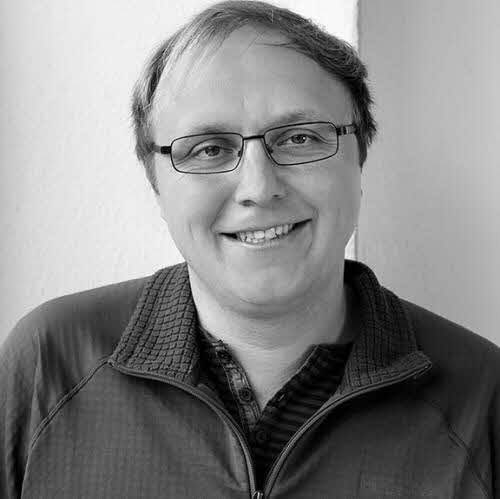
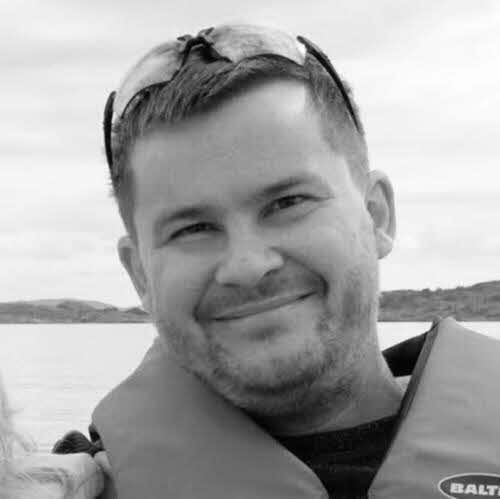
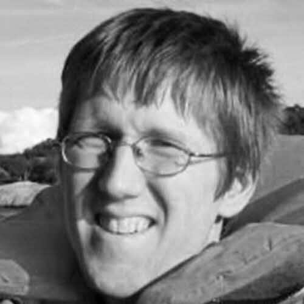
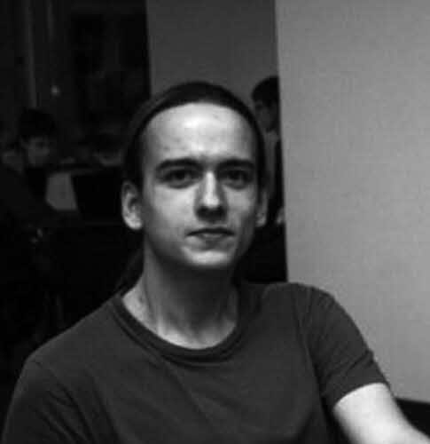
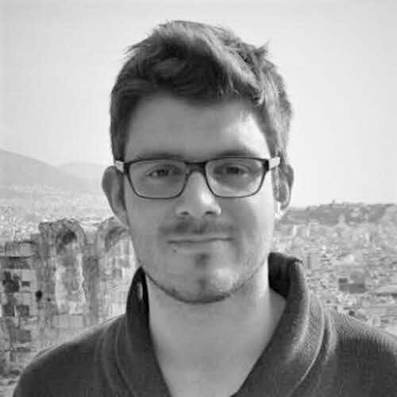
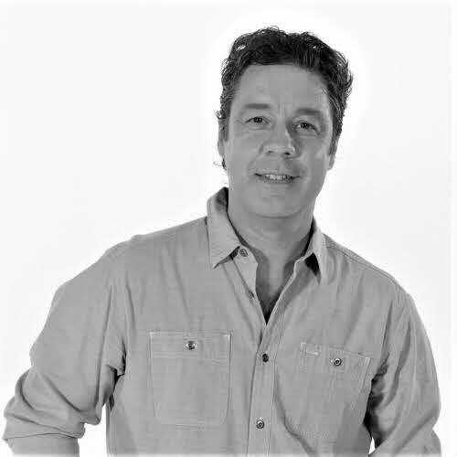

<Section id="team_members">

# A global community of movers
Crypto believers and true experts in each of their fields, who have taken on the challenge to build æternity.

::: slot team

#

-

- 
  ## Yanislav Malahov
  Founder
  > ### **Yanislav Malahov** *yani.chain*
  > Having exchanged ideas and pursued blockchain endeavors with many of the greatest minds, Yanislav is a true veteran of the blockchain space. Back in 2013, the "Godfather of Ethereum" envisioned powerful algorithms on blockchains. Now, with æternity, a new version of his vision is becoming reality once more.

-

# Core Development

- 
  ## Tino Breddin
  Core Developer Lead
  > ### **Tino Breddin** *botanicalcarebot.chain* 
  > Tino has started his career as a Systems Engineer at Erlang Solutions, where he helped build soft-realtime transaction systems and databases. After serving as Technical Director at Travelping, building the next-generation of SDN-enabled AAA appliances for telecoms, he founded daogames. At daogames Tino built a scalable multi-tenant infrastructure for multiplayer games used by mobile game developers globally. Currently Tino serves as Chief Architect for AR/VR system development at Vragments, while helping move forward the Aeternity Core development as team lead.

- 
  ## Ulf Wiger
  Core Developer
  > ### **Ulf Wiger** *uwigeroferlang.chain*
  > Ulf Wiger became one of the first commercial users of Erlang when he bought a license in 1993. In 1996, he joined Ericsson and became Chief Designer of the AXD 301 development, arguably the most complex system ever built in Erlang. In recent years, Ulf has been involved in products based on the AXD 301 architecture, and has been an active member of the Open Source Erlang community. In February 2009 he became CTO of Erlang Solutions. He is currently working on the æternity blockchain. 

- 
  ## Hans Svensson
  Core Developer
  > ### **Hans Svensson** *hanssv.chain*
  > Hans joined the project for the challenge and fun of building a state-of-the-art blockchain in Erlang. With a Masters in Engineering Physics and a PhD in Computer Science, he previously worked in research, testing and verifying distributed software in Erlang. Hans has consulted for major European companies, including Ericsson and Volvo. Currently he works as a QuickCheck Expert working on contracts and the Sophia language, as well as improving stability and performance during load. His fascination with new technology, and expertise in researching, developing and testing distributed software makes him an excellent addition to our team. Hans would like to see his work contribute to solving hard software development problems for æternity, through designing a versatile, modern blockchain. 

- 
  ## Karol Skocik
  Core Developer
  > ### **Karol Skocik** [y](https://www.youtube.com/watch?v=tLyKHY7-X5A)
  > Karol is freelancing since finishing university, working on web backends, telco, gaming, messaging and crypto areas. He is most proud of introducing Erlang to Gooddata (business intelligence) by writing most of their core services, as well as writing services for signalling emergencies for Everything Everywhere. Most enjoyable personal projects would be a microkernel OS and a realtime strategy game in Lisp & Erlang. He is interested in tech areas (compilers, languages, graph matching/rewriting, AI) but also like to read about history, psychology, business, mathematics and economy.

- 
  ## Dimitar Ivanov
  Core Developer
  > ### **Dimitar Ivanov** *dimitar.chain*
  > Dimitar joined the project because both æternity’s balanced approach and the star team of developers already involved impressed him. With a Bachelor’s Degree in Software Engineering, he spent a couple of years writing banking software and as a result, now maintains a distinct mistrust of banks. He currently works as a software engineer and has participated in the development of every part of the æternity node. His ability to build rock solid software, coupled with his fascination for the differences between traditional server software and blockchain (with regard to malicious nodes) makes him a valuable member of the team. He is happy to re-wire his brain to rise to this very interesting challenge. Through this work, Dimitar would like to make the world a better place. 

- 
  ## Alexander Filipov
  Core Developer
  > ### **Alexander Filipov**
  > Aleksandar like to continuously evolve and learn. In that aspect there are few places like æternity, where software skills really matters. He considers blockchains as a game changer and as fundamental new protocol of the distributed world. Aleksandar has been all over, going from real time embedded OS:e where he worked with hardware and matching OpenGL ES drivers all the way to automotive electrical systems and also a few years with end user apps including android apps for banking. Today he’s a big fan of functional programming, and is a driver for the eternity’s “channel services” which is a reference framework showcasing æternity’s unique state channels.
 
- 
  ## Grzegorz Uriasz
  Core Developer
  > ### **Grzegorz Uriasz**
  > Grzegorz’s fascination with blockchain started when Bitcoin first came out - he carefully tracked the advancements of the technology and amazing projects which were built using it. Having a background in cybersecurity and numerical simulations, loving cryptography, hunting for security bugs in the wild and analyzing malware in his free time he decided to join the æternity team and help to advance the technology. Excited by scalability challenges he is currently working on state channel technology. 

- 
  ## Radosław Rowicki
  Core Developer
  > ### **Radosław Rowicki** *radrowaeternity.chain*
  > Radosław is a fan of programming languages and paradigms, especially the functional ones. He did his Bachelor's degree at the University of Warsaw in 2019 and joined æternity to fulfill his destiny of compiler construction by working on Sophia. He is providing ideas, bugfixes and introducing new features to the language in the purpose of making it as comfortable to use as possible. Beside that he is the creator of the interactive shell for Sophia which simplifies the process of learning and testing the smart contracts. 

- 
  ## Ulf Norell
  Core Developer
  > ### **Ulf Norell** 
  > Ulf is an expert programmer and the brain behind the Agda programming language. He has more than ten years experience in Erlang. Ulf implemented several challenging parts of QuickCheck and tested Riak, Ejabberd, TCP/IP, Sidejob as well as distributed systems deemed difficult to test. He holds a PhD in Computer Science and is an expert in understanding complex scientific papers and implementing their concepts in any programming language. 

- 
  ## Thomas Arts
  Core Developer
  > ### **Thomas Arts**
  > Thomas joined the æternity team because of his desire to learn more about cryptography, software security and blockchain technology. Holding a PhD in Computer Science and working as a Professor in software engineering, he has over 20 years of experience programming Erlang. Currently he develops backend code for æternity, whilst writing and analyzing QuickCheck tests, including security analysis and the creation of a threat-model. As a senior computer scientist and Erlang expert, his easygoing and curious nature combine well with his strong mathematical background, allowing him to bring both theoretical and practical experience to our team. Thomas’ analytical skills are invaluable in detecting any errors in the system, thereby increasing the scope and abilities for the future of trustless applications. 
 
- 
  ## Michal Zajda
  Core Developer
  > ### **Michał Zajda** *transcontinental.chain*
  > Michal joined æternity to be part of this dynamic phase of blockchain evolution. Holding a Masters degree in Computer Science, his work background has been focused on the scalability of backend systems that support mobile communication, markets, and the IoT. Currently he works as an architect, coordinating our decentralized team of developers that work to try to bridge the blockchain world and real-world software capabilities. His experience in navigating the complexity of knowledge around network and state and his fascination with things like permaculture, primes him to organize the self-sustaining capabilities of his work for æternity. By enabling new ways of interacting via state channels, Michal is looking forward to seeing the new value that blockchains will bring to the world. 

- 
  ## Daniela Ivanova
  Core Developer
  > ### **Daniela Ivanova** *danielaivanova.chain*
  > Daniela Ivanova has been working as an Erlang/Elixir developer in Quanterall Ltd since 2016. She is keenly interested in Functional Programming, Blockchain, Distributed Systems, IoT and Software Design. 

- 
  ## Artur Kratt
  Core Developer
  > ### **Artur Kratt**
  > Artur Kratt is an Elixir Developer, currently studying the blockchain and associated technologies. Arthur believes blockchain innovation is the future of money and economics and is quickly growing his understanding of and engagement with the field. 

- 
  ## Nikita Fuchs
  Core Developer
  > ### **Nikita Fuchs**
  > Nikita joined the team because he saw it as a chance to create a great protocol for trustless decentralization, fairness and transparency. Bringing a background in Business Informatics and building production-grade solutions on the Ethereum Blockchain to the development side, he currently works as a Blockchain Application Developer and development coordinator in conjunction with our æpps and core development team. The æternity project benefits from his economics studies which currently amplify his ability to aid the team in both the development and building of various applications, as laws of value are an essential part of blockchain technology. Through this work, Nikita hopes to be able to aid in the creation of a mass-scalable, fair protocol, by the people- for the people.

- 
  ## Dincho Todorov
  Technical support
  > ### **Dincho Todorov** *dincho.chain*
  > Dincho joined the project because of his passion for cryptography and excitement to work with a “dream team” of large scale technology. With a Bachelor of Computer Systems and Technologies and a Master of Software Engineering, he has worked in web and mobile development and as the CTO of both a web startup and a mobile development agency. Currently working in SRE for the team, he is responsible for configuring, running and deploying our testnet/mainnet/dev environments. His expertise in networking, web and mobile primes him to help the team to build better product. Through this work, Dincho would like to see the development of fully autonomous processes, contribute to a great user experience and ultimately to provide an innovative, secure and stable technology. 
-
-
-

# Superhero Development

- 
  ## Milen Radkov
  Technical Lead
  > ### **Milen Radkov** *milenradkov.chain*
  > Milen is a blockchain developer and enthusiast, software engineer and entrepreneur, started his blockchain journey as a miner. Since the beginning of 2019 he is also part of the European Commission Blockchain Experts representing Bulgaria. He is founder of hack.bg, focused on developing products, smart contracts, decentralised apps and consulting in the blockchain technology space and complex software systems. Milen is also the organiser of several blockchain related technological meetups in Bulgaria. He joined aeternity development teams developing waellet browser extension. Later on involved in specification of different standards and currently lead of the superhero team.

- 
  ## Keno Dreßel
  Superhero Developer
  > ### **Keno Dreßel** *kenodressel.chain*
  > Keno Dreßel started his software career 13 years ago with web development. Since then he completed a bachelors and masters degree in computer science and has been working on various full stack projects after this. After his studies he moved to freelance fullstack projects and joined æternity blockchain in 2018. He developed his interest in blockchain in 2015 and has been an avid user and supporter of the technology since. 

- 
  ## Philipp Piwowarsky
  Superhero Developer
  > ### **Phillipp Piwowarsky** *philipp.chain*
  > Fascinated by the vision, ideology and technology of æternity, Philipp joined to be part of developing the future of blockchain. Having worked as a full stack software engineer, his previous work included full-stack development and system administration in various functional and object oriented languages. He currently works as a Blockchain Engineer, developing software. in addition he manages the technical and logistical aspects of multiple projects within the organization, to provide new blockchain platforms on which others can easily integrate their products. Phillipp’s passion for self sovereignty and the empowerment of individuals makes him a great fit for introducing more developers to blockchain. 

- 
  ## Nazar Duchak
  Superhero Developer
  > ### **Nazar Duchak**
  > 

- 
  ## Denis Davidyuk
  Superhero Developer
  > ### **Denis Davidyuk** *davidyuk.chain* [g](https://github.com/davidyuk) [in](https://www.linkedin.com/in/denis-davidyuk-9a9330141) 
  > Denis joined the team because he saw it as an opportunity to learn how to solve complex technical challenges. Having studied at the Far Eastern Federal University and received a Bachelor's degree in Applied Mathematics and Computer Science, after university he began building web applications using modern web technologies. Currently working as part of our aepps development team, his focus is on refining and optimizing the Superhero wallet and his previous work in building decentralized applications helps him in making accurate technical decisions. Although Denis believes that scalability is the most significant problem that this technology currently faces, he also believes that we can solve it.

- 
  ## Valentin Angelov
  Superhero Developer
  > ### **Valentin Angelov**
  > Valentin is a full stack developer. Joined aeternity because of his interest in blockchain technology, initially part of the waellet team. He is now working on superhero wallet and UI.

- 
  ## Stanislav Slavov
  Superhero Developer
  > ### **Stanislav Slavov**
  > Stanislav is a front-end developer with 5+ years of experience in developing scalable enterprise web applications and collaboration tools. Adept in Agile, experienced in international and distributed team environments. Passionate about English literature, running and computer games.

- 
  ## Petar Baykov
  Superhero Developer
  > ### **Petar Baykov**
  > Full-stack web developer, working on the superhero wallet extension, and other parts of the superhero project. Currently completing his Bachelor’s degree in Computer Science.

- 
  ## Nikita Tsedrik
  Superhero Developer
  > ### **Nikita Tsedrik**
  > Nikita joined the team thanks to a friend, who just couldn't stop talking about his work with æternity! With a Masters in Applied Mathematics and Computer Science, he is an enthusiastic learner, currently in the process of earning his PhD. After participating in a recent blockchain Hackathon, Nikita created a Ledger app for æternity and is currently working as a developer for the æpps team, focusing on refining both the Ledger and base-æpps. Nikita’s background in AR\VR and image recognition primes him for understanding how this technical medium can intersect with its human users. Nikita is fascinated by the limitless potential of blockchain and hopes through this work to increase every type of knowledge. 

- 
  ## Dmitry Kostin
  Superhero Developer
  > ### **Dmitry Kostin** *paradise.chain*
  > Dmitry was invited to work on æternity products by his friend. Educated with capability to solve problems on any language or framework, he found the idea of decentralized applications, widely used in cryptocurrency projects, very interesting for trying his skills. With more than a year of supporting Base Aepp, making it connected with other wallets and improving ease of usage for DApp developers, he is now joined big team to further improve cryptowallets and making it's usage more reasonable. 
-
-

# Design

- 
  ## Ivaylo Badinov
  Design Lead
  > ### **Ivaylo Badinov** *jeanlucpicard.chain* [f](https://github.com/venimus) [in](https://www.linkedin.com/in/badinov/)
  > Ivaylo is from Varna, Bulgaria. For the last 20 years he worked in development from scratch of multiple web-based business, educational and social platforms as well as various start-ups. Although having a Master degree in Electronics, he have chosen to work on software development. He first joined æternity in June 2019 as Site Reliability Engineer and later started as a Lead of the designers and a frontend developer. He also develops the æternity.com site and manages operations of Superhero.

- 
  ## Tsvetan Kolev
  Senior Designer
  > ### **Tsvetan Kolev** *tsvetan.chain* 
  > Tsvetan is Sofia based web and visual designer focused on UX/UI and implementation of the best practices of User Cenetered Design in his work. He has over 10 years of experience in the design field ranging from digital agencies and personal clients to product companies. He is excited about the blockchain technology and its disruptive potential for innovation and transformation of different sectors of the global society and economy. He considers blockchain to be one of the leading technology trends defining the next decade and further. This particular interest led him to discover æternity blockchain project and in the end of 2019 he joined the team as a Senior Designer. 

- 
  ## Darren Alawi
  Designer
  > ### **Darren Alawi**
  > Darren always wanted to work at a leading edge technology company that shares the same values as him, that technology and the internet should be equal for everyone so æternity is a great match. He's been designing digital products for over 20 years, working inside companies and for agencies that serve multiple clients. Darren is currently a product and brand designer at æternity working on the new Superhero product. 

- 
  ## Boris Bolonjek
  Designer
  > ### **Boris Bolonjek** *dubbwise.chain*
  > Senior full-stack product designer with experience in automotive, blockchain, gaming, productivity, no-code, edu and fintech startups

# Communications & Marketing

- 
  ## Leah Stuhltrager
  Interim CMO
  > ### **Leah Stuhltrager**
  > Leah Stuhltrager has developed, managed, and marketed ART::TECH projects for over 20 years. Career highlights include leading projects for high profile venues around the globe, campaigns with brands leading their industries, curating esteemed events, as well as community initiatives building industry bridges between America, Europe, Asia.

- 
  ## Cecille De Jesus
  Communications Manager
  > ### **Cecille De Jesus** *theScientress.chain*
  > Cecille is interested in the social impact of blockchain and technology in general, particularly how decentralization can reduce inequalities—how it can change the dysfunctional ways of modern society. Before becoming part of the æternity community, she taught visual communication as well as UI/UX in colleges in the Philippines, Her background covered communications strategy, art direction, campaigns, and was a project manager and author for science and tech website Futurism. She is absolutely honored to be part of æternity, a solid project backed by rigorous research from an exceptionally talented league of programmers, and above all, a genuine drive to deliver technology for a better world. She currently works as Head of Media and Public Relations and also contributes to UI/UX design.

- 
  ## Liubov Sharga
  Growth Hacker
  > ### **Liubov Sharga** *sinonimboga.chain*
  > Liubov is an experienced marketing professional with expertise in the digital marketing area. For the last years, she has been working with high-tech blockchain startups. She was also involved in the preparation and presentation of blockchain conferences around the world. Passionate for what she does as a lifestyle, Liubov is interested in the innovations bringing true benefits to the business. She is impressed with the whole range of opportunities that æternity's technology offers to the world and has its practical implementation. Her goal is to involve more and more people to use the unique technologies that æternity provides. 

- 
  ## Vanessa Guzmán
  Americas Community Manager
  > ### **Vanessa Guzmán** [t](https://twitter.com/vanegl12) [m](https://medium.com/@guzmanlvanessa)
  > Vanessa joined the æternity team for the innovative possibilities it offers, with regard to scalability and the large number of use cases to which it will be applied. As a systems engineer and software developer, she came to us with an already established IT background, including extensive knowledge in database development. Currently she works as our Hispanic Community Manager, using her technological experience to understand and share the scope and benefits of blockchain in an enthusiastic and informed way to the wider community. Vanessa hopes that by engaging followers on multiple mediums, she will be able to help æternity to reach the Hispanic community and achieve mass adoption of the technology. 

- 
  ## Mark Le
  Chinese Community Manager
  > ### **Mark Le**
  > Mark believes in the full scope of the æternity blockchain and felt joining our team would be the most direct way to  promote an æ ecosystem within China. With a Bachelor degree from the Harbin Institute of Technology Mark has an experience as both the Overseas Distribution Manager in CHINT and PR Manager in Geely. Currently he works as our  Chinese Community Manager, interfacing and coordinating with the Chinese community; making real-time connections  between the æternity team and the community in China including mining, promoting, marketing make him the ideal  person to engage Chinese community members. Mark hopes that through this work, he will be able to help create a Powerful æternity ecosystem in China.
 
- 
  ## José Frugoni
  PR and Social Media Management for Americas
  > ### **José Frugoni**
  > José Frugoni is part of the communication team of Aeternity Americas. As a professional journalist, he has worked in radio, television and the press, specializing in the development of digital platforms. He has been linked to digital projects for business and communication platforms for more than two decades. José worked as an editor at Terra Networks Uruguay and Spain, coordinated the digital newsroom of Radio El Espectador and is a web editor for the Uruguay Semanario Búsqueda. I currently live in Montevideo

- 
  ## Mariana Sanguinetti
  Public Relations Director
  > ### **Mariana Sanguinetti**
  > With a background in Business Development Mariana works for the expansion of æternity blockchain in Americas as part of the Americas Team, co-creating new business solutions based on blockchain, such as traceability. She feels blockchain is the future that is already here. æternity blockchain offers a safe, scalable  way for companies to switch to this new technology and her role is to enable this happening. As Experience Manager Mariana creates innovative experiences for people that are in contact with the æternity brand at events, gatherings and meet ups helping expose the use of this technology in an understandable and entertaining way.

 - 
    ## Alex Casas
    Ecosystem Lead
    > ### **Alex Casas**
    > Alex was an early member of the æternity community since he knew the project in March 2017 and realized his alignment with the vision and technological potential of æternity blockchain. He has been devoted to the BPO/ITO industry related to Business development, operations, and management roles for over 17 years, scaling a company from scratch to 3.000 employees and 13 facilities in 4 countries in two years as its general manager. Passionate about blockchain potential to achieve a more balanced and fair world, he has founded or co-founded several social impact initiatives, some to be built on the æternity network. As a highly committed and hard worker, he is supporting the æcosystem growth, product development and operations to contribute together with the team to the mass adoption of æternity.

- 
  ## Erik Vollstädt
  Æmbassador Manager
  > ### **Erik Vollstädt** *erikvollstaedt.chain*
  > Erik joined the team because he saw æternity’s potential to improve on Ethereum and Bitcoin's deficits through state channels and functional programming languages like Erlang and Elixir. With a Masters of Science in Business Innovation & Technology Management from Girona, Catalunya, he has experience in lead generation for apps marketing, product testing and content editing and has worked as the Co-Founder and Community Director of Bitnation. Currently working as æmbassador Manager, he coordinates and engages community feedback and ambassador collaborations both on and offline. Erik ultimately hopes to counteract to the abuse of power by politicians and the banking sector by growing æternity’s user base and expanding the projects’ reach, worldwide. 

- 
  ## Omar Saadoun
  Developer Aembassador Manager
  > ### **Omar Saadoun**
  > Omar Saadoun is a software engineer working on technology since ever, worked as CEO of INMIND for many blockchain projects and discovered on aeternity the full potential to unlock meaningful and real life projects. As technical lead of Americas he can be in touch with startups and companies to lead them on how to get the best from aeternity and make their technology succeed.

-
-

# Business Development

- 
  ## Helmut Müller
  Æternity Labs CEO
  > ### **Helmut Müller**
  > Helmut joined the team with a desire to get the word out about æternity’s fascinating work and state of the art blockchain. Having studied business, entrepreneurship and mechanical engineering, Helmut worked as a strategy consultant, and general manager for UK's fastest growing e-commerce startup and has been closely involved with the blockchain sphere since 2012. Currently he handles day-to-day marketing team alignments, focusing on process analysis and improvement. His previous work in strategy consulting helps him to analyze these processes to define strategy for better execution. Through this work, he would like to reestablish trust with the wider public regarding blockchain technology and blockchain funding, as well as contribute to more widespread usage of æternity blockchain. 

- 
  ## Magnus Maynard
  Head of Alliances
  > ### **Magnus Maynard**
  > Magnus believes æternity is taking Blockchain to the next level, mass adoption. With an extensive background in advanced technologies and system integration across EMEA, Asia Pacific and North America; Magnus sees æternity Blockchain as the leading light in revolutionising business practice. Having personally led integration businesses and their clients from digital to IP & streaming, Magnus is now focussed on assisting æternity partners and their clients in bringing Blockchain into relevant aspects of their business. With a fundamental belief in decentralised principles, Magnus was attracted to æternity due to its progressive thinking around this area, not only in its offering but the way of life it provides. Magnus also believes that æternity provides an unprecedented opportunity to assist the evolution of business through blockchain. 

- 
  ## Gonzalo Sobral
  Enterprise Lead Æmbassador
  > ### **Gonzalo Sobral**
  > Gonzalo has a degree in Communication and a Master in Business Administration. For the last 20 years he has been working as Business Developer and Consultant in Digital Transformation in companies related to Data Science, Blockchain and Digital Marketing. He developed his journalistic career in radio, written press, TV and web during the last 35 years. He also teaches Innovation, Ethics and Corporate Communication at University.
-

# Operations

- 
  ## Ingmar Zechlin
  COO
  > ### **Ingmar Zechlin**
  > Ingmar joined æternity because of his love for innovation on many levels which is embodied by æternity in  an outstanding way. He has a track record in change management and new technologies like digital  analytics,  data science and IoT, always focusing on business strategy on one hand and coordinating the  execution on the other. In his role as COO of æternity, he leads the overall operations team, including  Operations, legal, hr and finance with the aim to support the æternity project on its great journey into mainstream

- 
  ## Tina Miao
  Operations Manager
  > ### **Tina Miao** *freelikeabird.chain*
  > Tina joined æternity on seeing blockchain’s massive potential to disrupt the status quo of many industries. Holding a Bachelor’s degree in Engineering and a Master in Computer Science, Tina has more than 15 years’ experience driving challenging IT projects in logistics, telecommunications and the medical device industry. Currently working for the æternity Crypto Foundation and development for the Asia-Pacific region, she also handles AE token listings. As a global citizen, she has worked in Australia, China, India, Malaysia, Switzerland and is now based in Liechtenstein. Technological advancements that facilitate scalability, transparency, and privacy truly excite Tina, and she would like to contribute to æternity becoming the blockchain with the largest worldwide adoption. 

- 
  ## Olga Polishchuck
  HR Manager
  > ### **Olga Polishchuck**
  > Olga is an HR Manager at æternity Establishment since 2019, where she is responsible for various HR and Recruitment processes. Prior to joining æternity team, she has collaborated with different startups from  recruitment agencies to software companies. Broad experience in international IT recruitment and HR brought  her to work with æternity team on a fascinating blockchain project. People at æternity trying to solve real-world problems using blockchain technologies, and Olga is fascinated to  be part of the community, hire the right talents and help to tokenize the world.

- 
  ## Thomas Nägele
  External Legal Advisor
  > ### **External Legal Advisor**
  > Thomas Nägele, Attorney at Law at NÄGELE Attorneys at Law LLC, focuses on legal advice in the area of IT law. The handling of legal advice surrounding blockchain technology requires both legal expertise and knowledge of IT, two areas in which Mr. Nägele undoubtedly possesses the requisite skills. Outside of his formal legal education and numerous years of experience in the legal industry, and his knowledge in the area of IT is unsurpassed; witnessed by his continued involvement in software programming over the past 10 years, combined with his involvement with Bitcoin and Blockchain technology since 2011. Thomas also advises clients in international finance, technology and industrial enterprises, operating in the fields of Blockchain/DLT, telecommunications and internet, as well as public institutions. Besides being Attorney and legal Advisor, he teaches at the University of Liechtenstein, giving lectures and presentations on the newest legal developments. Serving as co-founder of the CCA, Mr. Nägele can be viewed as responsible for numerous developments regarding information technology within the county.   
-

#

-

- 
  ## You
  We are hiring
  > ### **You**
-

:::

</Section>

<ClickableElements selector="#team_members li" excludeSelector=".active blockquote"/>
