<Section id="team_members">

## A global community of movers
Crypto believers and true experts in each of their fields, who have taken on the challenge to build æternity.

::: slot team

- 
  ## Yanislav Malahov
  Founder
  > ### **Yanislav Malahov** *yani.chain*
  > Having exchanged ideas and pursued blockchain endeavors with many of the greatest minds, Yanislav is a true veteran of the blockchain space. Back in 2013, the "Godfather of Ethereum" envisioned powerful algorithms on blockchains. Now, with æternity, a new version of his vision is becoming reality once more.

- 
  ## Tino Breddin
  Lead of Core developers
  > ### **Tino Breddin** 
  > Having exchanged ideas and pursued blockchain endeavors with many of the greatest minds, Yanislav is a true veteran of the blockchain space. Back in 2013, the "Godfather of Ethereum" envisioned powerful algorithms on blockchains. Now, with æternity, a new version of his vision is becoming reality once more.

- 
  ## Ulf Wiger
  Erlang developer
  > ### **Ulf Wiger**
  > Ulf Wiger became one of the first commercial users of Erlang when he bought a license in 1993. In 1996, he joined Ericsson and became Chief Designer of the AXD 301 development, arguably the most complex system ever built in Erlang. In recent years, Ulf has been involved in products based on the AXD 301 architecture, and has been an active member of the Open Source Erlang community. In February 2009 he became CTO of Erlang Solutions. He is currently working on the æternity blockchain. 

- 
  ## Ulf Norell, PhD
  Erlang developer
  > ### **Ulf Norell** 
  > Ulf is an expert programmer and the brain behind the Agda programming language. He has more than ten years experience in Erlang. Ulf implemented several challenging parts of QuickCheck and tested Riak, Ejabberd, TCP/IP, Sidejob as well as distributed systems deemed difficult to test. He holds a PhD in Computer Science and is an expert in understanding complex scientific papers and implementing their concepts in any programming language. 
 
- 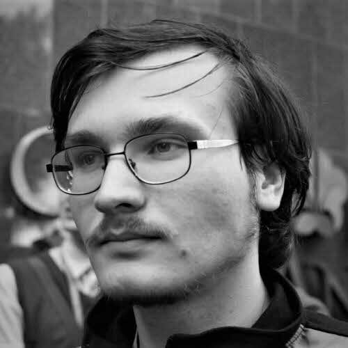
  ## Grzegorz Uriasz
  Erlang Developer
  > ### **Grzegorz Uriasz**
  > Grzegorz’s fascination with blockchain started when Bitcoin first came out - he carefully tracked the advancements of the technology and amazing projects which were built using it. Having a background in cybersecurity and numerical simulations, loving cryptography, hunting for security bugs in the wild and analyzing malware in his free time he decided to join the æternity team and help to advance the technology. Excited by scalability challenges he is currently working on state channel technology. 

- 
  ## Hans Svensson, PhD
  Erlang Developer
  > ### **Hans Svensson**
  > Hans joined the project for the challenge and fun of building a state-of-the-art blockchain in Erlang. With a Masters in Engineering Physics and a PhD in Computer Science, he previously worked in research, testing and verifying distributed software in Erlang. Hans has consulted for major European companies, including Ericsson and Volvo. Currently he works as a QuickCheck Expert working on contracts and the Sophia language, as well as improving stability and performance during load. His fascination with new technology, and expertise in researching, developing and testing distributed software makes him an excellent addition to our team. Hans would like to see his work contribute to solving hard software development problems for æternity, through designing a versatile, modern blockchain. 

- 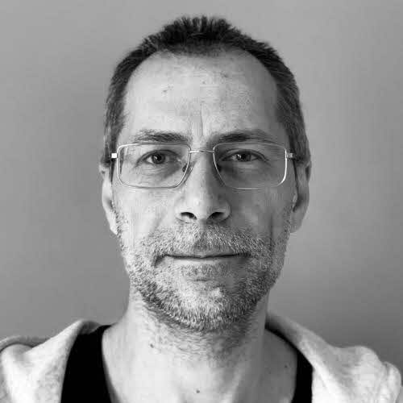
  ## Ivaylo Badinov
  Lead of Designers, POM
  > ### **Ivaylo Badinov** *jeanlucpicard.chain* [f](https://facebook.com/venimus) [in](https://www.linkedin.com/in/badinov/)
  > Ivaylo is from Varna, Bulgaria. For the last 20 years he worked in development from scratch of multiple web-based business, educational and social platforms as well as various start-ups. Although having a Master degree in Electronics, he have chosen to work in the web-based software field. He first joined æternity in June 2019 as Site Reliability Engineer and later joined the Superhero team as a frontend developer, having great experience in web-development and UI/UX. Currently leads the designer team and work as a Project Operations Manager. He also develops the æternity.com site.

- 
  ## Tsvetan Kolev
  Designer
  > ### **Tsvetan Kolev** 
  > Tsvetan is Sofia based web and visual designer focused on UX/UI and implementation of the best practices of User Cenetered Design in his work. He has over 10 years of experience in the design field ranging from digital agencies and personal clients to product companies. He is excited about the blockchain technology and its disruptive potential for innovation and transformation of different sectors of the global society and economy. He considers blockchain to be one of the leading technology trends defining the next decade and further. This particular interest led him to discover æternity blockchain project and in the end of 2019 he joined the team as a Senior Designer. 

- 
  ## Valentin Alexiev
  Product Development
  > ### **Valentin Alexiev** 
  > Blockchain and crypto are Valentin's passion since the early years of Bitcoin when only some crazy people believed in it. He is a long time apps architect and software developer. Valentin is inspired by the vision of blockchain society and is interested in finding use cases to apply this novel technology towards this vision.
 
- 
  ## Vanessa Guzmán
  Hispanic Community Manager
  > ### **Vanessa Guzmán** [t](https://twitter.com/vanegl12) [m](https://medium.com/@guzmanlvanessa)
  > Vanessa joined the æternity team for the innovative possibilities it offers, with regard to scalability and the large number of use cases to which it will be applied. As a systems engineer and software developer, she came to us with an already established IT background, including extensive knowledge in database development. Currently she works as our Hispanic Community Manager, using her technological experience to understand and share the scope and benefits of blockchain in an enthusiastic and informed way to the wider community. Vanessa hopes that by engaging followers on multiple mediums, she will be able to help æternity to reach the Hispanic community and achieve mass adoption of the technology. 

- 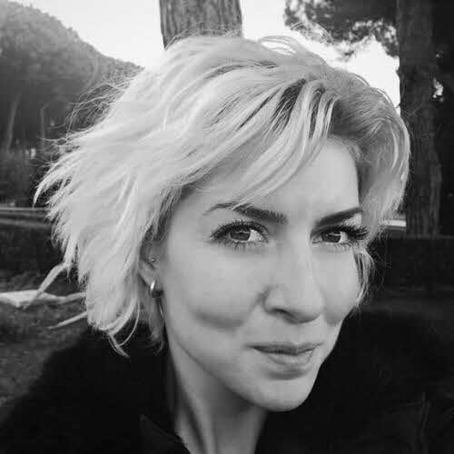
  ## Albena Kostova
  Community Manager
  > ### **Albena Kostova**
  > Albena joined the team with a fascination for blockchain technology and its potential to change how we conduct our lives. Holding a Bachelor's Degree in European Studies and a Master's in Entrepreneurship, she brings to us experience from work in Information Services, Due Diligence, and Anti-Money Laundering Services. Currently working as a Community Manager, Albena is responsible for moderating social media and other communication channels. Her previous work in online content has given her a healthy skepticism around what can be found online, so she now strives to provide our followers with a full picture and as much detailed information as possible. Through this work, Albena would love to see our community grow worldwide, to attract next big app to be developed on æternity blockchain. 

- 
  ## Alexander Filipov
  Erlang Developer
  > ### **Alexander Filipov**
  > Aleksandar like to continuously evolve and learn. In that aspect there are few places like æternity, where software skills really matters. He considers blockchains as a game changer and as fundamental new protocol of the distributed world. Aleksandar has been all over, going from real time embedded OS:e where he worked with hardware and matching OpenGL ES drivers all the way to automotive electrical systems and also a few years with end user apps including android apps for banking. Today he’s a big fan of functional programming, and is a driver for the eternity’s “channel services” which is a reference framework showcasing æternity’s unique state channels.

- 
  ## Alex Casas
  Æmbassadors Programme Manager
  > ### **Alex Casas**
  > Alex was an early member of the æternity community since he knew the project in March 2017 and realized his alignment with the vision and technological potential of æternity blockchain. He has been devoted to the BPO/ITO industry related to Business development, operations, and management roles for over 17 years, scaling a company from scratch to 3.000 employees and 13 facilities in 4 countries in two years as its general manager. Passionate about blockchain potential to achieve a more balanced and fair world, he has founded or co-founded several social impact initiatives, some to be built on the æternity network. As a highly committed and hard worker, he is supporting the æcosystem growth, product development and operations to contribute together with the team to the mass adoption of æternity.  

- 
  ## Artur Kratt
  Erlang/Elixir developer
  > ### **Artur Kratt**
  > Artur Kratt is an Elixir Developer, currently studying the blockchain and associated technologies. Arthur believes blockchain innovation is the future of money and economics and is quickly growing his understanding of and engagement with the field. 

- 
  ## Cecille De Jesus
  Head of Communications
  > ### **Cecille De Jesus**
  > Cecille is interested in the social impact of blockchain and technology in general, particularly how decentralization can reduce inequalities—how it can change the dysfunctional ways of modern society. Before becoming part of the æternity community, she taught visual communication as well as UI/UX in colleges in the Philippines, Her background covered communications strategy, art direction, campaigns, and was a project manager and author for science and tech website Futurism. She is absolutely honored to be part of æternity, a solid project backed by rigorous research from an exceptionally talented league of programmers, and above all, a genuine drive to deliver technology for a better world. She currently works as Head of Media and Public Relations and also contributes to UI/UX design.

- 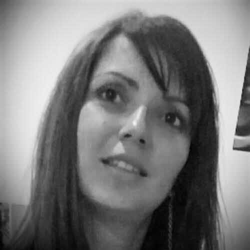
  ## Daniela Ivanova
  Erlang/Elixir developer
  > ### **Daniela Ivanova**
  > Daniela Ivanova has been working as an Erlang/Elixir developer in Quanterall Ltd since 2016. She is keenly interested in Functional Programming, Blockchain, Distributed Systems, IoT and Software Design. 

- 
  ## Darren Alawi
  Designer
  > ### **Darren Alawi**
  > Darren always wanted to work at a leading edge technology company that shares the same values as him, that technology and the internet should be equal for everyone so æternity is a great match. He's been designing digital products for over 20 years, working inside companies and for agencies that serve multiple clients. Darren is currently a product and brand designer at æternity working on the new Superhero product. 

- 
  ## Dimitar Ivanov
  Erlang Developer
  > ### **Dimitar Ivanov**
  > Dimitar joined the project because both æternity’s balanced approach and the star team of developers already involved impressed him. With a Bachelor’s Degree in Software Engineering, he spent a couple of years writing banking software and as a result, now maintains a distinct mistrust of banks. He currently works as a software engineer and has participated in the development of every part of the æternity node. His ability to build rock solid software, coupled with his fascination for the differences between traditional server software and blockchain (with regard to malicious nodes) makes him a valuable member of the team. He is happy to re-wire his brain to rise to this very interesting challenge. Through this work, Dimitar would like to make the world a better place. 

- 
  ## Dincho Todorov
  Lead SRE
  > ### **Dincho Todorov**
  > Dincho joined the project because of his passion for cryptography and excitement to work with a “dream team” of large scale technology. With a Bachelor of Computer Systems and Technologies and a Master of Software Engineering, he has worked in web and mobile development and as the CTO of both a web startup and a mobile development agency. Currently working in SRE for the team, he is responsible for configuring, running and deploying our testnet/mainnet/dev environments. His expertise in networking, web and mobile primes him to help the team to build better product. Through this work, Dincho would like to see the development of fully autonomous processes, contribute to a great user experience and ultimately to provide an innovative, secure and stable technology. 

- 
  ## Ivaylo Papazov
  SRE
  > ### **Ivaylo Papazov**
  > As a proponent of transparency technologies, Ivaylo was motivated to joined æternity, after seeing what they've built up so far for the end-user - things that put them ahead of similar competitors.  Having a bachelor degree in Computer Science Technology, Ivaylo has experience working on complex web-based applications - social network platforms, custom booking systems - and mobile-based applications. Now he is a part of the system reliability engineering team.  As most people working in the field, Ivaylo is attracted to solving intellectual problems with the technology he is adept at. He hopes to help keep the edge of æternity over their competitors sharp.

- 
  ## Dmitry Kostin
  dApps Developer
  > ### **Dmitry Kostin**
  > Dmitry was invited to work on æternity products by his friend. Educated with capability to solve problems on any language or framework, he found the idea of decentralized applications, widely used in cryptocurrency projects, very interesting for trying his skills. With more than a year of supporting Base Aepp, making it connected with other wallets and improving ease of usage for DApp developers, he is now joined big team to further improve cryptowallets and making it's usage more reasonable. 

- 
  ## Elisaveta Gerogieva
  ÆVentures
  > ### **Elisaveta Gerogieva**
  > Elisaveta is interested in entrepreneurship and everything related to it since her teenage years. She has started (and still running) a couple of companies, developed a few products and brands, and now she is also working for the global image of the ÆVentures team. Two of her greatest passions are marketing & crypto.  

- 
  ## Erik Vollstädt
  Æmbassador
  > ### **Erik Vollstädt**
  > Erik joined the team because he saw æternity’s potential to improve on Ethereum and Bitcoin's deficits through state channels and functional programming languages like Erlang and Elixir. With a Masters of Science in Business Innovation & Technology Management from Girona, Catalunya, he has experience in lead generation for apps marketing, product testing and content editing and has worked as the Co-Founder and Community Director of Bitnation. Currently working as æmbassador Manager, he coordinates and engages community feedback and ambassador collaborations both on and offline. Erik ultimately hopes to counteract to the abuse of power by politicians and the banking sector by growing æternity’s user base and expanding the projects’ reach, worldwide. 
 
- 
  ## Gonzalo Sobral
  > ### **Gonzalo Sobral**
  > Gonzalo has a degree in Communication and a Master in Business Administration. For the last 20 years he has been working as Business Developer and Consultant in Digital Transformation in companies related to Data Science, Blockchain and Digital Marketing. He developed his journalistic career in radio, written press, TV and web during the last 35 years. He also teaches Innovation, Ethics and Corporate Communication at University.

- 
  ## Helmut Müller
  Chief Marketing Manager
  > ### **Helmut Müller**
  > Helmut joined the team with a desire to get the word out about æternity’s fascinating work and state of the art blockchain. Having studied business, entrepreneurship and mechanical engineering, Helmut worked as a strategy consultant, and general manager for UK's fastest growing e-commerce startup and has been closely involved with the blockchain sphere since 2012. Currently he handles day-to-day marketing team alignments, focusing on process analysis and improvement. His previous work in strategy consulting helps him to analyze these processes to define strategy for better execution. Through this work, he would like to reestablish trust with the wider public regarding blockchain technology and blockchain funding, as well as contribute to more widespread usage of æternity blockchain. 

- 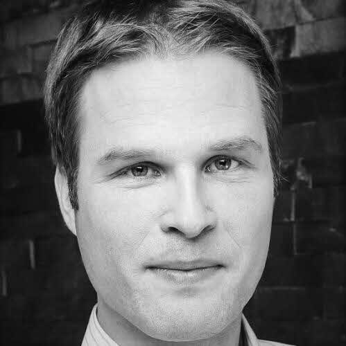
  ## Ingmar Zechlin
  Operations Manager
  > ### **Ingmar Zechlin**
  > Ingmar joined æternity because of his love for innovation on many levels which is embodied by æternity in  an outstanding way. He has a track record in change management and new technologies like digital  analytics,  data science and IoT, always focusing on business strategy on one hand and coordinating the  execution on the other. In his role as COO of æternity, he leads the overall operations team, including  Operations, legal, hr and finance with the aim to support the æternity project on its great journey into mainstream

- 
  ## Jivko Gradinarov
  ÆVentures
  > ### **Jivko Gradinarov**
  > Jivko joined æternity ventures one year ago, fascinated by blockchain technology and the benefits it brings to the society. He brings over 18 years of experience in the field of visual communication - graphic concepts, corporate identity and logo design, packaging design, any print materials for marketing purposes, promotion design, web design, UI/UX enhancements, mail newsletters, social media campaigns. He worked with some of the biggest adv. agencies like Ogilvy, McCanEricsson and BBDO. Jivko is responsible for for all the visuals on all the channels ÆVentures uses to communicate the world - social media campaigns, infographics, new products brand and websites, key visuals, æternity ventures brand identity development and support, supporting startups on their graphical needs, etc. 

- 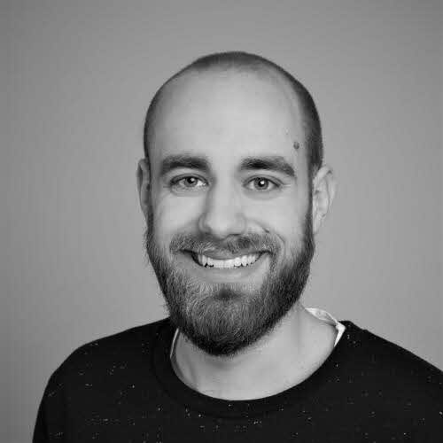
  ## Keno Dreßel
  Developer
  > ### **Keno Dreßel**
  > Keno Dreßel started his software career 13 years ago with web development. Since then he completed a bachelors and masters degree in computer science and has been working on various full stack projects after this. After his studies he moved to freelance fullstack projects and joined æternity blockchain in 2018. He developed his interest in blockchain in 2015 and has been an avid user and supporter of the technology since. 

- 
  ## Lale Mahrt
  Communications
  > ### **Lale Mahrt**
  > Lale joined the team with an instinct for æternity’s defining role in the exciting blockchain scene. Currently doing a Marketing Communication apprenticeship in an accounting company, she has worked extensively in gastronomy and for various start-ups as an online marketing manager. Lale’s skills in marketing and accounting, prime her for her current position as accountant and personal assistant to our COO. Her varied experience has made her proactive in thinking ahead, to find ways to make things easier for herself and others. Committed to leaving a positive contribution, or 'footprint’, Lale would like to not only optimize accounting practices in the crypto scene, but also hopes to let people know that they are not alone. 

- 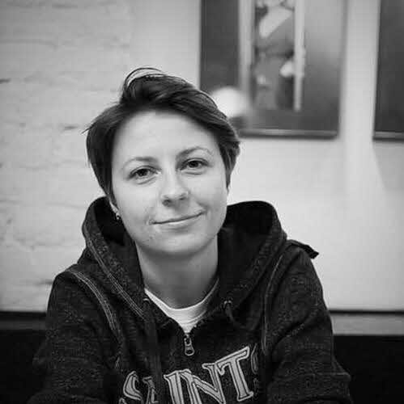
  ## Liubov Sharga
  Marketing
  > ### **Leah Stuhltrager**
  > Liubov is an experienced marketing professional with expertise in the digital marketing area. For the last years, she has been working with high-tech blockchain startups. She was also involved in the preparation and presentation of blockchain conferences around the world. Passionate for what she does as a lifestyle, Liubov is interested in the innovations bringing true benefits to the business. She is impressed with the whole range of opportunities that æternity's technology offers to the world and has its practical implementation. Her goal is to involve more and more people to use the unique technologies that æternity provides. 

- 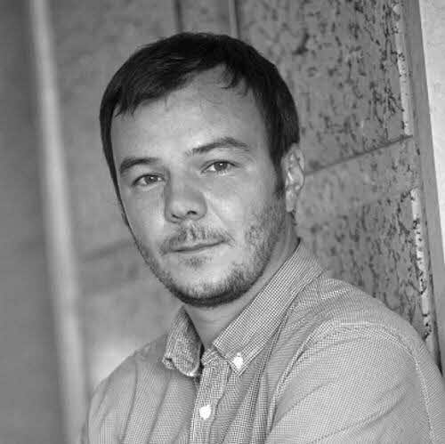
  ## Luka Sucic
  Marketing
  > ### **Luka Sucic**
  > Luka joined æternity with a desire to actively participate in the way the world is changing. With an educational background in law, entrepreneurship and tech, he began his career as a startup entrepreneur, starting many projects and companies before joining a large telecommunications corporation. Most recently, Luka started working for a venture investment company, investing and partnering with startups and other corporations. Currently working with æternity’s incubator/accelerator, he advises on structuring partnerships that will most benefit the growth and sustainability of the ecosystem. Through this work, Luka would like to see the old, inefficient, closed and un-transparent systems we use today, replaced so that the world might change into a more just and fair place. 

- 
  ## Luka Ciganek
  Business Development
  > ### **Luka Ciganek**
  > Luka is passionate about blockchain and how it can change and improve our economic models. He is a serial startup founder, recognized from the US State Department as a young innovation leader. Prior to joining æternity he listed his company on Australian Stock Exchange and served as key executive for building teams, products and scaling business. He is currently in æternity working as a business developer fostering æternity ecosystem through Starfleet accelerator program, scouting, onboarding, mentoring and helping startups to build on æternity and create synergies for the ecosystem.  

- 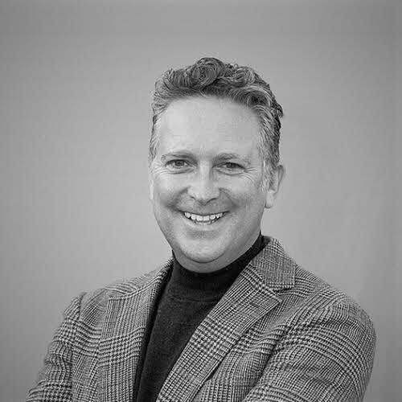
  ## Magnus Maynard
  > ### **Magnus Maynard**
  > Magnus believes æternity is taking Blockchain to the next level, mass adoption. With an extensive background in advanced technologies and system integration across EMEA, Asia Pacific and North America; Magnus sees æternity Blockchain as the leading light in revolutionising business practice. Having personally led integration businesses and their clients from digital to IP & streaming, Magnus is now focussed on assisting æternity partners and their clients in bringing Blockchain into relevant aspects of their business. With a fundamental belief in decentralised principles, Magnus was attracted to æternity due to its progressive thinking around this area, not only in its offering but the way of life it provides. Magnus also believes that æternity provides an unprecedented opportunity to assist the evolution of business through blockchain. 
 
- 
  ## Mariana Sanguinetti
  Experience Manager
  > ### **Mariana Sanguinetti**
  > With a background in Business Development Mariana works for the expansion of æternity blockchain in Americas as part of the Americas Team, co-creating new business solutions based on blockchain, such as traceability. She feels blockchain is the future that is already here. æternity blockchain offers a safe, scalable  way for companies to switch to this new technology and her role is to enable this happening. As Experience Manager Mariana creates innovative experiences for people that are in contact with the æternity brand at events, gatherings and meet ups helping expose the use of this technology in an understandable and entertaining way.
 
- 
  ## Mark Le
  Chinese Community Manager
  > ### **Mark Le**
  > Mark believes in the full scope of the æternity blockchain and felt joining our team would be the most direct way to  promote an æ ecosystem within China. With a Bachelor degree from the Harbin Institute of Technology Mark has an experience as both the Overseas Distribution Manager in CHINT and PR Manager in Geely. Currently he works as our  Chinese Community Manager, interfacing and coordinating with the Chinese community; making real-time connections  between the æternity team and the community in China including mining, promoting, marketing make him the ideal  person to engage Chinese community members. Mark hopes that through this work, he will be able to help create a Powerful æternity ecosystem in China.
 
- 
  ## Mattia Martinez
  House of Blockchain Manager
  > ### **Mattia Martinez**
  > Mattia joined the team to be involved in the blockchain industry, to be a part of something that could make a difference and to learn as much as possible. With a background in online marketing, design and project management, he currently works as the House of Blockchain Manager, running the co-working space, on-boarding and supporting residents and coordinating Blockchain events in Liechtenstein. His passion for tech and his reliability - even in unstructured environments, makes him an excellent addition to the team. Mattia would like to use his talents to help build a blockchain hub and ecosystem for Liechtenstein and beyond. 
 
- 
  ## Michal Zajda
  Developer
  > ### **Mattia Martinez**
  > Michal joined æternity to be part of this dynamic phase of blockchain evolution. Holding a Masters degree in Computer Science, his work background has been focused on the scalability of backend systems that support mobile communication, markets, and the IoT. Currently he works as an architect, coordinating our decentralized team of developers that work to try to bridge the blockchain world and real-world software capabilities. His experience in navigating the complexity of knowledge around network and state and his fascination with things like permaculture, primes him to organize the self-sustaining capabilities of his work for æternity. By enabling new ways of interacting via state channels, Michal is looking forward to seeing the new value that blockchains will bring to the world. 

- 
  ## Nikita Cedrik
  Developer
  > ### **Nikita Cedrik**
  > Nikita joined the team thanks to a friend, who just couldn't stop talking about his work with æternity! With a Masters in Applied Mathematics and Computer Science, he is an enthusiastic learner, currently in the process of earning his PhD. After participating in a recent blockchain Hackathon, Nikita created a Ledger app for æternity and is currently working as a developer for the æpps team, focusing on refining both the Ledger and base-æpps. Nikita’s background in AR\VR and image recognition primes him for understanding how this technical medium can intersect with its human users. Nikita is fascinated by the limitless potential of blockchain and hopes through this work to increase every type of knowledge. 

- 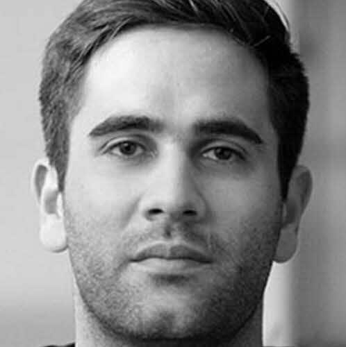
  ## Nikola Stojanov
  Starfleet
  > ### **Nikola Stojanov**
  > Nikola joined æternity on realizing the tremendous potential of both the company and blockchain technology. With a background in the pharmaceutical industry, he worked in Serbia, Germany and Bulgaria before taking the position of Director of Business Development in Asia for MENA Pacific in Hong Kong. Currently in his work as CBDO, Nikola is in charge of the business development and partnerships of æternity. He works tirelessly, collaborating and negotiating to further the development of the Starfleet Global Incubator Program and partnering with university programs. Nikola hopes through his work, with the help of æternity’s amazing technology and team, to have as many great applications built on æternity as possible, in order to create the most widely adopted platform/infrastructure in the world. 

- 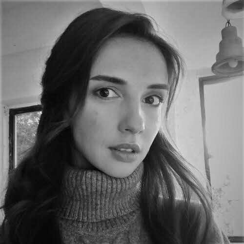
  ## Olga Polishchuck
  HR Administrator
  > ### **Nikola Stojanow**
  > Olga is an HR administrator at æternity Establishment since 2019, where she is responsible for various HR and Recruitment processes. Prior to joining æternity team, she has collaborated with different startups from  recruitment agencies to software companies. Broad experience in international IT recruitment and HR brought  her to work with æternity team on a fascinating blockchain project. People at æternity trying to solve real-world problems using blockchain technologies, and Olga is fascinated to  be part of the community, hire the right talents and help to tokenize the world.

- 
  ## Pablo Coirolo
  CEO Americas
  > ### **Pablo Coirolo**
  > Pablo is passionate about transformative technologies and how they help expand human capabilities. He strongly believes in the power of decentralized systems and their potential to advance all aspects of human interaction. The core of his work is based on applying his diverse business experience background to the new Blockchain revolution and helping startups develop sustainable, legally compliant and viable Blockchain projects. He is also passionate on helping to build strong Blockchain Ecosystem. He is spearheading the development of Crypto Bay Montevideo to create a community of service providers and businesses to help Uruguay join the club of Crypto-friendly jurisdictions. 

- 
  ## Philipp Piwowarsky
  Blockchain Engineer
  > ### **Phillipp Piwowarsky**
  > Fascinated by the vision, ideology and technology of æternity, Philipp joined to be part of developing the future of blockchain. Having worked as a full stack software engineer, his previous work included full-stack development and system administration in various functional and object oriented languages. He currently works as a Blockchain Engineer, developing software. in addition he manages the technical and logistical aspects of multiple projects within the organization, to provide new blockchain platforms on which others can easily integrate their products. Phillipp’s passion for self sovereignty and the empowerment of individuals makes him a great fit for introducing more developers to blockchain. 

- 
  ## Thomas Arts, PhD
  Researcher
  > ### **Thomas Arts**
  > Thomas joined the æternity team because of his desire to learn more about cryptography, software security and blockchain technology. Holding a PhD in Computer Science and working as a Professor in software engineering, he has over 20 years of experience programming Erlang. Currently he develops backend code for æternity, whilst writing and analyzing QuickCheck tests, including security analysis and the creation of a threat-model. As a senior computer scientist and Erlang expert, his easygoing and curious nature combine well with his strong mathematical background, allowing him to bring both theoretical and practical experience to our team. Thomas’ analytical skills are invaluable in detecting any errors in the system, thereby increasing the scope and abilities for the future of trustless applications. 

- 
  ## Tina Miao
  > ### **Tina Miao**
  > Tina joined æternity on seeing blockchain’s massive potential to disrupt the status quo of many industries. Holding a Bachelor’s degree in Engineering and a Master in Computer Science, Tina has more than 15 years’ experience driving challenging IT projects in logistics, telecommunications and the medical device industry. Currently working for the æternity Crypto Foundation and development for the Asia-Pacific region, she also handles AE token listings. As a global citizen, she has worked in Australia, China, India, Malaysia, Switzerland and is now based in Liechtenstein. Technological advancements that facilitate scalability, transparency, and privacy truly excite Tina, and she would like to contribute to æternity becoming the blockchain with the largest worldwide adoption. 
 
- 
  ## Djordje Filipovic
  Business developer
  > ### **Djordje Filipovic**
  > Djordje joined the æternity project because he believes in awesome ideas that have unlimited growth potential. With a Bachelor of Science in Economics and currently pursuing a Master of Science in Finance, he has completed internships in both banking and the auto industry. Currently Djordje works in business development - supporting the incubation of startup projects, establishing and maintaining partnerships, as well as promoting æternity at conferences and events worldwide. His previously acquired skills and understanding of business models are of great help in all aspects of the development of the project, ranging from communication to identifying new business. Over the next two years, Djordje hopes to help æternity to become one of the largest ecosystems of its kind, in the world. 

- 
  ## Leah Stuhltrager
  Chief Marketing Officer
  > ### **Leah Stuhltrager**
  > Leah Stuhltrager has developed, managed, and marketed ART::TECH projects for over 20 years. Career highlights include leading projects for high profile venues around the globe, campaigns with brands leading their industries, curating esteemed events, as well as community initiatives building industry bridges between America, Europe, Asia.

- 
  ## Gökhan Menge
  
  > ### **Gökhan Menge**
  > Gökhan is a blockchain and marketing enthusiast, who loves to learn about limitless possibilities on both. He has both corporate and (failed) startup experiences. As a full-stack marketing guy, he was working closely with lots of startups in the last few years, providing mentorship on topics such as marketing, web site design, UX and lead generation 

- 
  ## Bozhana Shoshkova
  > ### **Bozhana Shoshkova**
  > With BS in Marketing and MS in Advertising Management Bozhana Shoshkova has several years of event management, operations and administration experience in the corporate, non-profit and cultural sector and is skilled in development of organisational structures and account administration. She has managed a wide range of events, including workshops, training, conferences and festivals both in Bulgaria and abroad and is skilled and passionate about the development of organisational structures, work arrangements and setting things in the right order 

- 
  ## Radosław Rowicki
  > ### **Radosław Rowicki**
  > Radosław is a fan of programming languages and paradigms, especially the functional ones. He did his Bachelor's degree at the University of Warsaw in 2019 and joined æternity to fulfill his destiny of compiler construction by working on Sophia. He is providing ideas, bugfixes and introducing new features to the language in the purpose of making it as comfortable to use as possible. Beside that he is the creator of the interactive shell for Sophia which simplifies the process of learning and testing the smart contracts. 

- 
  ## Yoana Decheva
  > ### **Yoana Decheva**
  > Yoana brings 7 years of experience in the civil society sector, in grants making and organizational development. She would like to use her talents to help contribute to a sustainable ecosystem of Blockchain supporters and innovators and their transformative projects.

- 
  ## Stefka Stojanow
  > ### **Stefka Stojanow**
  > Steffy is bringing over 8 years of marketing and management experience to our team after working for major international retailers and FMCG companies. Joining the blockchain community, she is excited about the possibilities of the decentralized world and the opportunity to apply her experience and know-how into promoting the blockchain technologies.

- 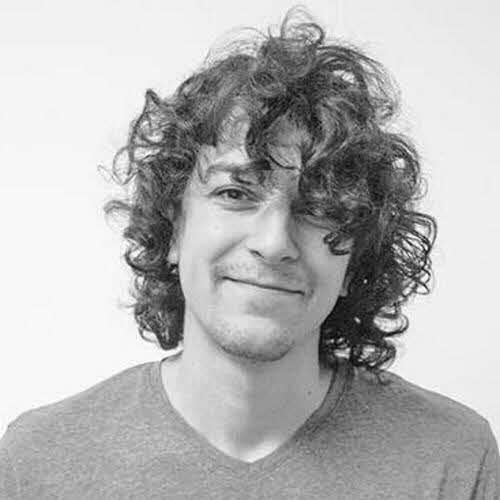
  ## Milen Radkov
  Lead Developer
  > ### **Milen Radkov**
  > 

- 
  ## Denis Davidyuk
  Developer
  > ### **Denis Davidyuk**
  > 

- 
  ## Nazar Duchak
  Developer
  > ### **Nazar Duchak**
  > 

- 
  ## Stanislav Slavov
  Developer
  > ### **Stanislav Slavov**
  > 

- 
  ## Petar Baykov
  Developer
  > ### **Petar Baykov**
  > 

- 
  ## You
  We are hiring
  > ### **You**
-
-

:::

</Section>

<ClickableElements selector="#team_members li" />
